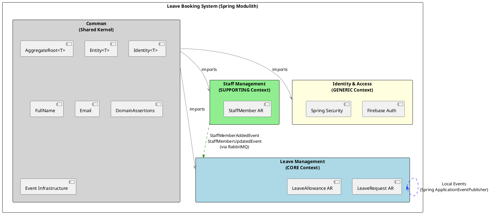
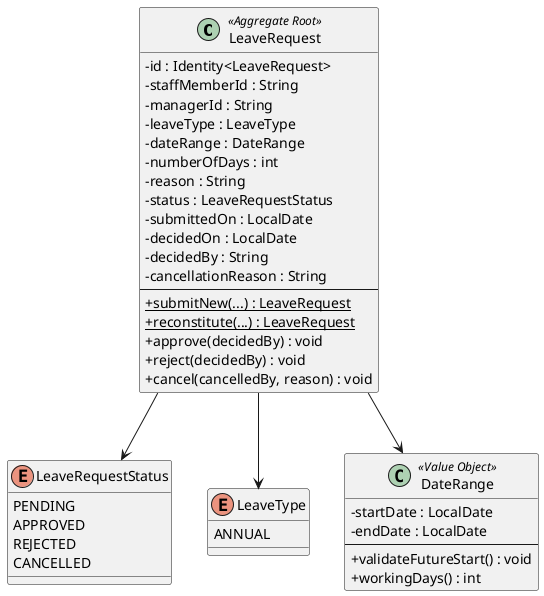
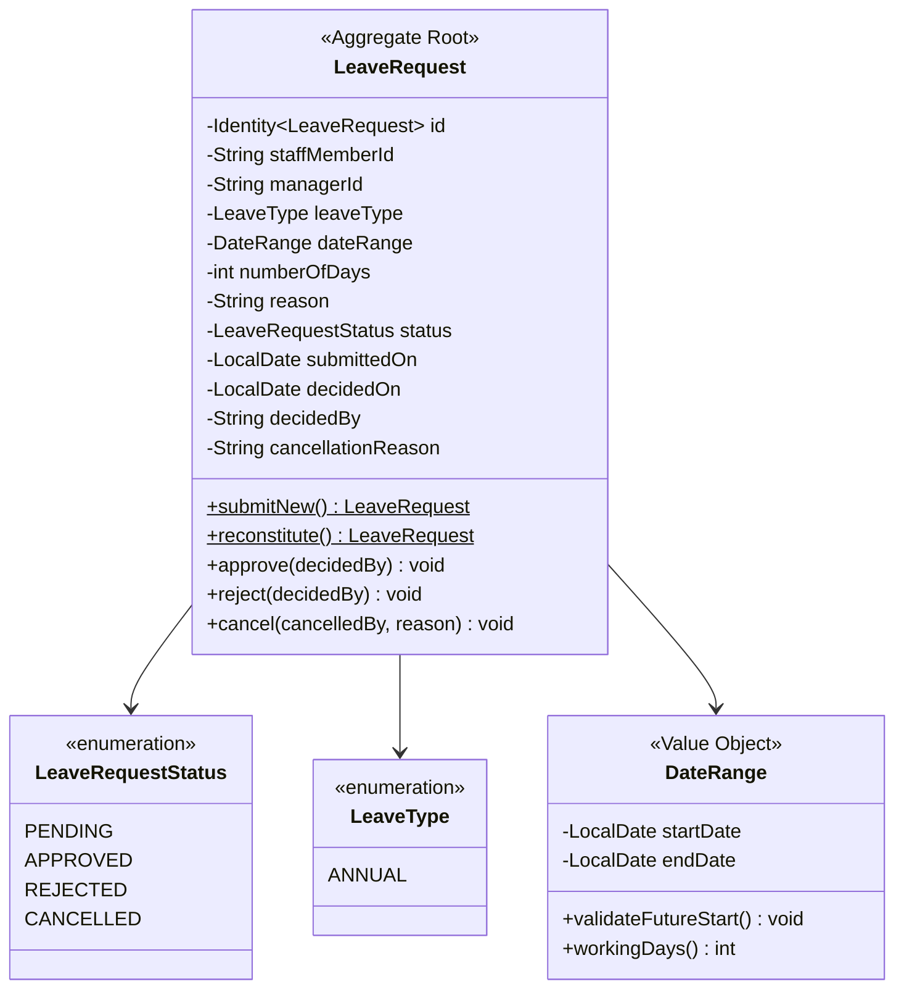
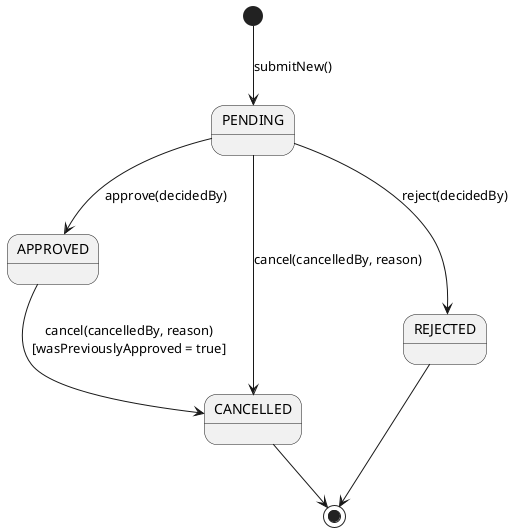
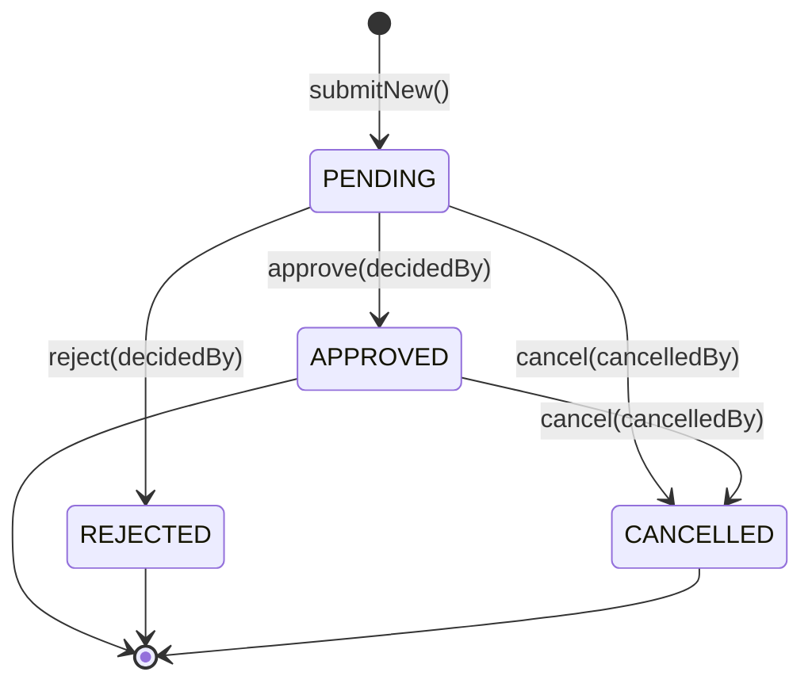
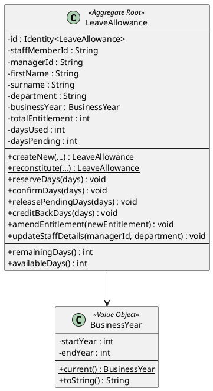
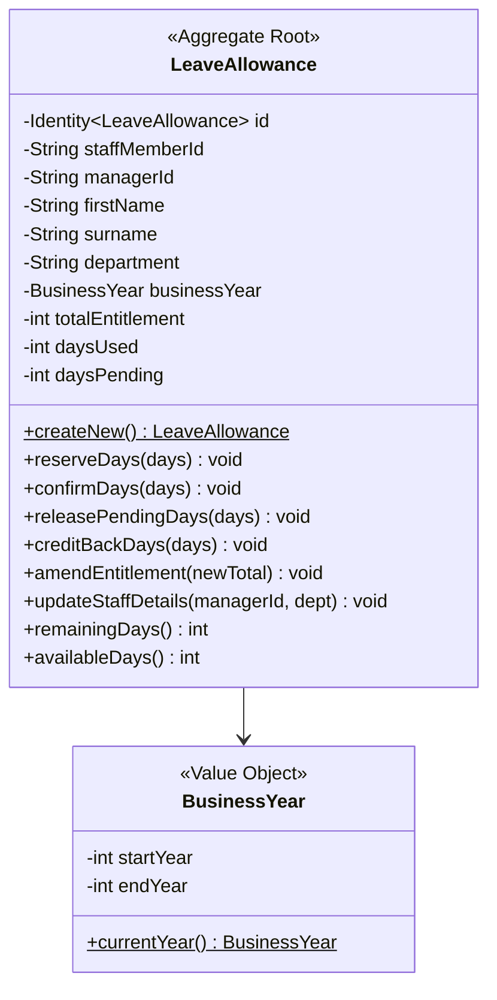
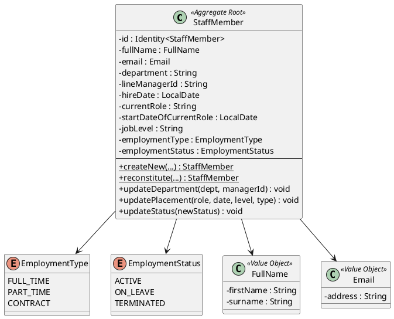
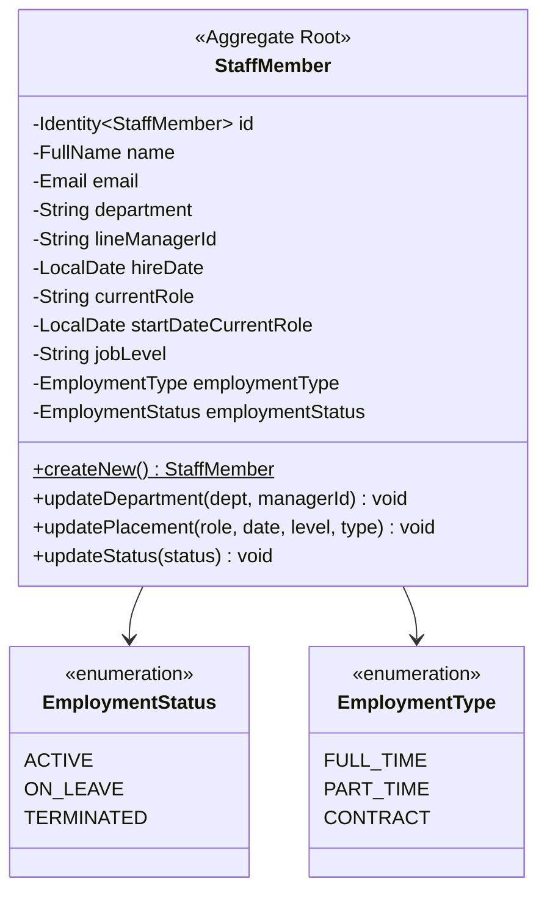
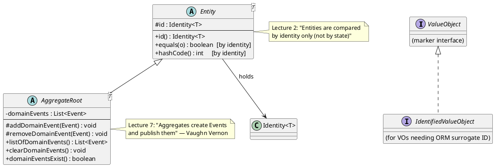

# Domain Model Design — Leave Booking System

**Module:** COMP60047 Enterprise Application Development
**Lecturer:** Phil James — Staffordshire University
**Lecture Alignment:** Lectures 2 (DDD, Entities, Value Objects), 3 (Aggregates), 4 (Records, DTOs, Modulith), 7 (Local Events), 8 (Remote Events)

---

## 1. Bounded Contexts

The system is decomposed into three bounded contexts following Evans' Strategic DDD (Lecture 2, pp. 8–12). Each context has its own ubiquitous language, its own domain model, and communicates with other contexts only through events or the Shared Kernel.



**Architecture Overview (text representation):**

```
┌─────────────────────────────────────────────────────────────────────────────┐
│                    Leave Booking System (Spring Modulith)                     │
├─────────────────────────────────────────────────────────────────────────────┤
│                                                                              │
│  ┌──────────────────────────┐     ┌──────────────────────────┐              │
│  │   LEAVE MANAGEMENT       │     │   STAFF MANAGEMENT        │              │
│  │   (Core Context)         │     │   (Supporting Context)    │              │
│  │                          │     │                           │              │
│  │  LeaveRequest (aggregate)│     │  StaffMember (aggregate)  │              │
│  │  LeaveAllowance (aggr.)  │◄────│  Events: Added, Updated   │              │
│  │  4 local + 4 remote evts │     │                           │              │
│  │  CQRS: commands+queries  │     │  CRUD via facade          │              │
│  └──────────────────────────┘     └──────────────────────────┘              │
│              ▲                                  │                             │
│              │ Remote Events (RabbitMQ)         │                             │
│              └─────────────────────────────────┘                             │
│                                                                              │
│  ┌──────────────────────────┐     ┌──────────────────────────┐              │
│  │   COMMON (Shared Kernel) │     │   IDENTITY (Generic)      │              │
│  │                          │     │   Non-DDD                 │              │
│  │  AggregateRoot, Entity   │     │  Firebase Auth            │              │
│  │  Identity, Email, FullName│     │  Spring Security RBAC     │              │
│  │  DomainEventManager      │     │  JWT validation           │              │
│  │  EventStoreService       │     │  @PreAuthorize            │              │
│  └──────────────────────────┘     └──────────────────────────┘              │
│                                                                              │
└─────────────────────────────────────────────────────────────────────────────┘
```

### 1.1 Leave Management Context (CORE)

The primary business domain. All leave-related operations — submitting requests, approving/rejecting, tracking allowances — live here. This is the context where DDD is applied most rigorously: aggregates, value objects, domain events, invariants, CQRS.

**Ubiquitous Language:**
- **LeaveRequest** — a formal application by a staff member for time off
- **LeaveAllowance** — the annual entitlement and balance tracker for a staff member
- **Pending** — awaiting manager decision
- **Approved/Rejected/Cancelled** — terminal or semi-terminal states
- **Balance** — remaining days available (`totalEntitlement - daysUsed - daysPending`)
- **Business Year** — the annual period an allowance covers (e.g. 2026–2027)

### 1.2 Staff Management Context (SUPPORTING)

A façade to a broader HR system (as the brief states: "Staff management... is a façade to a bigger HR information system"). Holds staff member details that the Leave Management context needs. Publishes remote events when staff are added or updated.

**Ubiquitous Language:**
- **StaffMember** — an employee record
- **Department** — organisational unit
- **LineManager** — the person who approves/rejects leave
- **Placement** — role, job level, and employment type
- **EmploymentStatus** — lifecycle state (ACTIVE → ON_LEAVE → TERMINATED)

### 1.3 Identity and Access Control (GENERIC — non-DDD)

Handles authentication and authorisation. Uses Firebase for cloud-based user management and Spring Security for RBAC. Explicitly **not** domain-driven (no aggregates, no domain folder) — mirrors Phil's Lecture 9 approach where the Identity context is a "generic" supporting utility, not a business domain.

**Ubiquitous Language:**
- **User** — an authenticated account
- **Role** — STAFF, MANAGER, or ADMIN
- **Token** — JWT issued by Firebase
- **Authority** — Spring Security `ROLE_` prefixed grant

---

## 2. Aggregate Design (Lecture 3)

Evans defines an aggregate as:

> "A cluster of domain objects that can be treated as a single unit. Any references from outside the aggregate should only go to the aggregate root." — Eric Evans, *Domain-Driven Design* (2003), p. 126

Phil's Lecture 3 emphasises:
- **Small aggregates** — each aggregate should be as small as possible (one root + its value objects)
- **Consistency boundary** — invariants are enforced within a single aggregate, in a single transaction
- **Inter-aggregate communication via events** — aggregates never directly call each other

### 2.1 LeaveRequest Aggregate Root



**Mermaid representation:**



#### State Machine

The LeaveRequest follows a strict state machine pattern. Invalid transitions throw `IllegalStateException`:



**Mermaid representation:**



#### Code Implementation (with JavaDoc)

```java
/**
 * Aggregate Root representing a leave request.
 * Implements a state machine: PENDING → APPROVED | REJECTED | CANCELLED; APPROVED → CANCELLED.
 *
 * <p>Two factory methods separate event-raising creation from read-path reconstitution:
 * <ul>
 *   <li>{@link #submitNew} — raises {@link LeaveRequestSubmittedEvent} (Lecture 7 pattern)</li>
 *   <li>{@link #reconstitute} — no events (used by JPA→Domain mappers on the read path)</li>
 * </ul>
 *
 * <p>This follows the split-factory-method pattern from Lecture 7 where the case-study's
 * {@code OrderOfWithEvent} vs {@code OrderOf} factories are analogous to our
 * {@code submitNew} vs {@code reconstitute}.
 *
 * @see AggregateRoot  The base class providing event storage (Lecture 7)
 * @see LeaveRequestStatus  The enum representing valid states
 */
public class LeaveRequest extends AggregateRoot<LeaveRequest> {

    // ─── Error message constants (used in tests for assertion matching) ────
    public static final String STAFF_MEMBER_ID_REQUIRED = "Staff member ID is required";
    public static final String MANAGER_ID_REQUIRED = "Manager ID is required";
    public static final String LEAVE_TYPE_REQUIRED = "Leave type is required";
    public static final String DATE_RANGE_REQUIRED = "Date range is required";
    public static final String CANNOT_APPROVE_NON_PENDING = "Only PENDING requests can be approved";
    public static final String CANNOT_REJECT_NON_PENDING = "Only PENDING requests can be rejected";
    public static final String CANNOT_CANCEL_TERMINAL = 
            "Cannot cancel a request that is already REJECTED or CANCELLED";
    public static final String DECIDED_BY_REQUIRED = "Decided by (approver/rejector ID) is required";
    public static final String CANCELLED_BY_REQUIRED = "Cancelled by (user ID) is required";

    // ─── Fields (all private, accessed via DDD-style accessors — no "get" prefix) ────
    private final String staffMemberId;
    private final String managerId;
    private final LeaveType leaveType;
    private final DateRange dateRange;
    private final int numberOfDays;
    private final String reason;
    private LeaveRequestStatus status;          // mutable — state transitions
    private final LocalDate submittedOn;
    private LocalDate decidedOn;                // set on approve/reject
    private String decidedBy;                   // set on approve/reject
    private String cancellationReason;          // set on cancel

    /**
     * WRITE-PATH factory: Creates a new leave request and raises a domain event.
     *
     * <p>Validates:
     * <ul>
     *   <li>Start date must be in the future (cannot request leave retroactively)</li>
     *   <li>Date range must contain at least one working day (weekdays only)</li>
     * </ul>
     *
     * <p>Raises: {@link LeaveRequestSubmittedEvent} — consumed by
     * {@code LeaveRequestSubmittedListener} which calls
     * {@code LeaveAllowance.reserveDays(numberOfDays)}.
     *
     * @param id           Generated UUID identity
     * @param staffMemberId UUID of the requesting staff member
     * @param managerId    UUID of the assigned approver
     * @param leaveType    Type of leave (currently only ANNUAL)
     * @param dateRange    Start and end dates (inclusive)
     * @param reason       Optional textual reason
     * @return A new PENDING LeaveRequest with one domain event queued
     * @throws IllegalArgumentException if dates are invalid or zero working days
     */
    public static LeaveRequest submitNew(Identity<LeaveRequest> id, String staffMemberId,
                                          String managerId, LeaveType leaveType,
                                          DateRange dateRange, String reason) {
        dateRange.validateFutureStart();  // Invariant: no past dates

        int workingDays = dateRange.workingDays();
        if (workingDays <= 0) {
            throw new IllegalArgumentException(
                    "Leave request must include at least one working day");
        }

        LeaveRequest request = new LeaveRequest(
                id, staffMemberId, managerId, leaveType, dateRange, workingDays,
                reason, LeaveRequestStatus.PENDING, LocalDate.now(),
                null, null, null
        );

        // Raise domain event (Lecture 7: aggregate creates events)
        request.addDomainEvent(new LeaveRequestSubmittedEvent(
                LocalDate.now(), id.id(), staffMemberId, workingDays
        ));

        return request;
    }

    /**
     * READ-PATH factory: Reconstitutes from persistence without raising events.
     *
     * <p>Used by {@link LeaveRequestJpaToDomainMapper} when loading an existing
     * request for command processing. Does NOT validate future dates (the request
     * may be historical).
     */
    public static LeaveRequest reconstitute(/* all fields */) { ... }

    /**
     * Approves this leave request. Only valid from PENDING state.
     *
     * <p>State transition: PENDING → APPROVED
     * <p>Raises: {@link LeaveRequestApprovedEvent} → consumed by listener →
     * {@code LeaveAllowance.confirmDays(numberOfDays)}
     *
     * @param decidedBy UUID of the manager/admin who approved
     * @throws IllegalStateException if not in PENDING state
     * @throws IllegalArgumentException if decidedBy is null/blank
     */
    public void approve(String decidedBy) {
        argumentNotEmpty(decidedBy, DECIDED_BY_REQUIRED);
        if (this.status != LeaveRequestStatus.PENDING) {
            throw new IllegalStateException(CANNOT_APPROVE_NON_PENDING);
        }
        this.status = LeaveRequestStatus.APPROVED;
        this.decidedOn = LocalDate.now();
        this.decidedBy = decidedBy;

        addDomainEvent(new LeaveRequestApprovedEvent(
                LocalDate.now(), this.id.id(), this.staffMemberId, 
                decidedBy, this.numberOfDays
        ));
    }

    /**
     * Cancels this leave request. Valid from PENDING or APPROVED states.
     *
     * <p>State transitions:
     * <ul>
     *   <li>PENDING → CANCELLED (releases pending days)</li>
     *   <li>APPROVED → CANCELLED (credits back used days)</li>
     * </ul>
     *
     * <p>The {@code wasPreviouslyApproved} flag on the event tells the listener
     * whether to call {@code releasePendingDays()} or {@code creditBackDays()}.
     */
    public void cancel(String cancelledBy, String reason) {
        argumentNotEmpty(cancelledBy, CANCELLED_BY_REQUIRED);
        if (this.status == LeaveRequestStatus.REJECTED 
                || this.status == LeaveRequestStatus.CANCELLED) {
            throw new IllegalStateException(CANNOT_CANCEL_TERMINAL);
        }

        boolean wasPreviouslyApproved = (this.status == LeaveRequestStatus.APPROVED);
        this.status = LeaveRequestStatus.CANCELLED;
        this.cancellationReason = reason;

        addDomainEvent(new LeaveRequestCancelledEvent(
                LocalDate.now(), this.id.id(), this.staffMemberId, cancelledBy,
                this.numberOfDays, wasPreviouslyApproved
        ));
    }
}
```

#### Invariants (Business Rules)

| # | Invariant | Enforced By | Test Coverage |
|---|-----------|-------------|---------------|
| 1 | Start date must be in the future | `DateRange.validateFutureStart()` | `DateRangeTest.ValidateFutureStart` |
| 2 | End date ≥ start date | `DateRange` compact constructor | `DateRangeTest.ConstructionValidation` |
| 3 | At least one working day | `submitNew()` checks `workingDays() > 0` | `LeaveRequestTest.SubmitNew.shouldRejectZeroWorkingDays` |
| 4 | Only PENDING → APPROVED | `approve()` status check | `LeaveRequestTest.Approve.shouldRejectApproveFromApproved` |
| 5 | Only PENDING → REJECTED | `reject()` status check | `LeaveRequestTest.Reject.shouldRejectRejectFromApproved` |
| 6 | REJECTED/CANCELLED are terminal | `cancel()` status check | `LeaveRequestTest.Cancel.shouldRejectCancelFromRejected` |
| 7 | `decidedBy` must not be blank | `argumentNotEmpty()` guard | `LeaveRequestTest.Approve.shouldRejectBlankDecidedBy` |

---

### 2.2 LeaveAllowance Aggregate Root



**Mermaid representation:**



#### Code Implementation (with JavaDoc)

```java
/**
 * Aggregate Root tracking annual leave entitlement and balance for a staff member.
 *
 * <p>Updated via local events from LeaveRequest:
 * <ul>
 *   <li>Submitted → {@link #reserveDays(int)} increments daysPending</li>
 *   <li>Approved → {@link #confirmDays(int)} moves from pending to used</li>
 *   <li>Rejected → {@link #releasePendingDays(int)} decrements daysPending</li>
 *   <li>Cancelled (was approved) → {@link #creditBackDays(int)} decrements daysUsed</li>
 *   <li>Cancelled (was pending) → {@link #releasePendingDays(int)} decrements daysPending</li>
 * </ul>
 *
 * <p>Created via remote event from Staff Management ({@link StaffMemberAddedEvent}).
 *
 * <p><strong>Key Invariant (Lecture 3 — aggregate invariants):</strong>
 * {@code daysUsed + daysPending + newReservation <= totalEntitlement}
 * This prevents over-booking and is enforced in {@link #reserveDays(int)}.
 */
public class LeaveAllowance extends AggregateRoot<LeaveAllowance> {

    /**
     * Reserves days when a new leave request is submitted (PENDING).
     * Enforces the over-booking invariant.
     *
     * <p><strong>Invariant check:</strong> If reserving these days would cause
     * {@code daysUsed + daysPending + days > totalEntitlement}, an
     * {@link IllegalStateException} is thrown with a descriptive message
     * showing available vs requested days.
     *
     * @param days Number of working days to reserve (must be positive)
     * @throws IllegalArgumentException if days <= 0
     * @throws IllegalStateException if insufficient balance
     */
    public void reserveDays(int days) {
        argumentPositive(days, DAYS_MUST_BE_POSITIVE);
        if (daysUsed + daysPending + days > totalEntitlement) {
            int available = totalEntitlement - daysUsed - daysPending;
            throw new IllegalStateException(
                INSUFFICIENT_BALANCE + ". Available: " + available 
                + " days, Requested: " + days + " days"
            );
        }
        this.daysPending += days;
    }

    /**
     * Confirms days when a leave request is approved.
     * Moves days from pending to used.
     *
     * @param days Number of days to confirm
     * @throws IllegalStateException if days > daysPending
     */
    public void confirmDays(int days) {
        argumentPositive(days, DAYS_MUST_BE_POSITIVE);
        if (days > daysPending) {
            throw new IllegalStateException(CANNOT_RELEASE_MORE_THAN_PENDING);
        }
        this.daysPending -= days;
        this.daysUsed += days;
    }

    /**
     * Total days remaining (entitlement minus used).
     * Does NOT consider pending days.
     */
    public int remainingDays() {
        return totalEntitlement - daysUsed;
    }

    /**
     * Days still available to request (excludes both used and pending).
     * This is what a staff member sees as "available to book".
     */
    public int availableDays() {
        return totalEntitlement - daysUsed - daysPending;
    }
}
```

#### Invariants

| # | Invariant | Enforced By | Test Coverage |
|---|-----------|-------------|---------------|
| 1 | `totalEntitlement > 0` | `argumentPositive()` in constructor | `LeaveAllowanceTest.CreateNew.shouldRejectZeroEntitlement` |
| 2 | `daysUsed + daysPending + new <= totalEntitlement` | `reserveDays()` | `LeaveAllowanceTest.ReserveDays.shouldThrowOnOverbooking` |
| 3 | Cannot release more than pending | `releasePendingDays()` / `confirmDays()` | `LeaveAllowanceTest.ConfirmDays.shouldThrowWhenConfirmingMoreThanPending` |
| 4 | Cannot credit back more than used | `creditBackDays()` | `LeaveAllowanceTest.CreditBackDays.shouldThrowWhenCreditingMoreThanUsed` |
| 5 | New entitlement cannot be < daysUsed | `amendEntitlement()` | `LeaveAllowanceTest.AmendEntitlement.shouldRejectEntitlementBelowDaysUsed` |

---

### 2.3 StaffMember Aggregate Root (Supporting Context)



**Mermaid representation:**



#### Terminal State Invariant

```
ACTIVE ←→ ON_LEAVE    (bidirectional — can go back and forth)
ACTIVE → TERMINATED   (one-way — terminal)
ON_LEAVE → TERMINATED (one-way — terminal)
TERMINATED → ✗        (cannot transition out — enforced in updateStatus())
```

```java
/**
 * Updates employment status. Enforces: TERMINATED is a terminal state.
 *
 * <p><strong>Business Rule (Lecture 3 — invariants):</strong>
 * Once a staff member is terminated, they cannot be reactivated. This mirrors
 * real-world HR policy where termination is a permanent, irreversible action
 * requiring a new hire record if the person returns.
 *
 * @param newStatus The target status
 * @throws IllegalStateException if attempting to transition out of TERMINATED
 * @throws IllegalArgumentException if newStatus is null
 */
public void updateStatus(EmploymentStatus newStatus) {
    argumentNotNull(newStatus, EMPLOYMENT_STATUS_REQUIRED);
    if (this.employmentStatus == EmploymentStatus.TERMINATED 
            && newStatus != EmploymentStatus.TERMINATED) {
        throw new IllegalStateException(CANNOT_REACTIVATE_TERMINATED);
    }
    this.employmentStatus = newStatus;
}
```

---

## 3. Value Objects (Lecture 2)

Phil's Lecture 2 defines value objects:

> "An object that represents a descriptive aspect of the domain with no conceptual identity. Value objects are instantiated to represent elements of the design that we care about only for *what* they are, not *who* or *which* they are." — Evans (2003), p. 97

All value objects in this system are implemented as **Java records** (Lecture 4), which provide immutable fields, auto-generated `equals()`/`hashCode()` by value, and compact constructors for validation.

### 3.1 Common Value Objects

#### Identity\<T\>

```java
/**
 * Generic identity value object wrapping a UUID string.
 * The type parameter T binds the identity to a specific aggregate/entity
 * to prevent accidental mixing of identities at compile time.
 *
 * <p><strong>Lecture 2 pattern:</strong> This is the same Identity class from
 * Phil's lecture material (see "Identity Value Object" section) — it uses
 * UUID format validation in the compact constructor and provides two factory
 * methods: {@code of()} for reconstitution and {@code generateId()} for creation.
 *
 * <p><strong>Design decision:</strong> IDs are generated by the application
 * (not the database) because the domain owns identity creation. This makes
 * the system microservice-safe (no auto-increment conflicts across services).
 */
public record Identity<T>(String id) implements ValueObject {

    public static final String IDENTITY_CANNOT_BE_NULL = "Identity cannot be null or blank";

    public Identity {
        if (id == null || id.isBlank()) {
            throw new IllegalArgumentException(IDENTITY_CANNOT_BE_NULL);
        }
        // Accepts both UUID format (internally generated) and Firebase UID format
        // (alphanumeric strings). Firebase UIDs are used as staff record IDs for
        // cross-context consistency (Firebase UID = staff record ID = leave allowance staffMemberId).
    }

    /** Creates from existing ID string (persistence read path). */
    public static <T> Identity<T> of(String id) {
        return new Identity<>(id);
    }

    /** Generates a new random UUID identity (aggregate creation path). */
    public static <T> Identity<T> generateId() {
        return new Identity<>(UUID.randomUUID().toString());
    }
}
```

#### FullName

```java
/**
 * Value Object representing a person's full name.
 * Embeddable for use within JPA entities (Lecture 4: records as @Embeddable).
 *
 * <p>Validates: not empty, trimmed, max 50 characters each.
 * Uses {@link DomainAssertions} for precondition guards (Lecture 2 pattern).
 */
@Embeddable
public record FullName(String firstName, String surname) implements ValueObject {

    public static final int MAX_FIRST_NAME_LENGTH = 50;
    public static final int MAX_SURNAME_LENGTH = 50;

    public FullName {
        firstName = argumentNotEmpty(firstName, FIRST_NAME_NOT_EMPTY);  // trims
        surname = argumentNotEmpty(surname, SURNAME_NOT_EMPTY);          // trims
        argumentLength(firstName, 1, MAX_FIRST_NAME_LENGTH, FIRST_NAME_LENGTH);
        argumentLength(surname, 1, MAX_SURNAME_LENGTH, SURNAME_LENGTH);
    }
}
```

#### Email

```java
/**
 * Value Object representing a validated email address.
 * Follows Lecture 2's pattern where value objects self-validate on construction.
 */
public record Email(String address) implements ValueObject {

    private static final String EMAIL_REGEX = 
            "^[A-Za-z0-9+_.-]+@[A-Za-z0-9.-]+\\.[A-Za-z]{2,}$";

    public Email {
        address = argumentNotEmpty(address, EMAIL_NOT_EMPTY);
        argumentMatchesPattern(address, EMAIL_REGEX, EMAIL_INVALID_FORMAT);
    }
}
```

### 3.2 Leave Management Value Objects

#### DateRange

```java
/**
 * Value Object representing a date range (start to end, inclusive).
 * Calculates working days (excluding weekends — Saturday and Sunday).
 *
 * <p>The {@link #validateFutureStart()} method is called only during submission
 * (write path) — not during reconstitution from persistence. This separation
 * ensures historical requests can be loaded without throwing exceptions.
 */
public record DateRange(LocalDate startDate, LocalDate endDate) implements ValueObject {

    public DateRange {
        argumentNotNull(startDate, START_DATE_NOT_NULL);
        argumentNotNull(endDate, END_DATE_NOT_NULL);
        if (endDate.isBefore(startDate)) {
            throw new IllegalArgumentException(END_BEFORE_START);
        }
    }

    /** Only called at submission time — not on reconstitution. */
    public void validateFutureStart() {
        if (!startDate.isAfter(LocalDate.now())) {
            throw new IllegalArgumentException(START_DATE_IN_PAST);
        }
    }

    /** Counts weekdays (Mon–Fri) inclusive of both start and end. */
    public int workingDays() {
        int count = 0;
        LocalDate current = startDate;
        while (!current.isAfter(endDate)) {
            DayOfWeek day = current.getDayOfWeek();
            if (day != DayOfWeek.SATURDAY && day != DayOfWeek.SUNDAY) {
                count++;
            }
            current = current.plusDays(1);
        }
        return count;
    }
}
```

#### BusinessYear

```java
/**
 * Value Object representing a business year period (e.g. 2026-2027).
 * The end year is always start year + 1.
 *
 * <p>Used by LeaveAllowance to scope entitlement to a specific annual period.
 */
public record BusinessYear(int startYear, int endYear) implements ValueObject {

    public BusinessYear {
        if (startYear <= 0) throw new IllegalArgumentException(INVALID_START_YEAR);
        if (endYear != startYear + 1) throw new IllegalArgumentException(END_YEAR_MUST_FOLLOW_START);
    }

    /** Factory for the current business year based on today's date. */
    public static BusinessYear current() {
        int currentYear = LocalDate.now().getYear();
        return new BusinessYear(currentYear, currentYear + 1);
    }
}
```

#### LeaveReason

```java
/**
 * Value Object representing the reason for a leave request.
 * Max 500 characters, must not be blank. Trimmed on construction.
 */
public record LeaveReason(String reason) implements ValueObject {

    public static final int MAX_LENGTH = 500;

    public LeaveReason {
        reason = argumentNotEmpty(reason, REASON_NOT_EMPTY);
        argumentLength(reason, 1, MAX_LENGTH, REASON_TOO_LONG);
    }
}
```

---

## 4. DomainAssertions Utility (Lecture 2)

Phil's Lecture 2 introduces `DomainAssertions` as a utility class providing **precondition guards** — static methods that validate arguments and throw `IllegalArgumentException` on failure. This replaces verbose if/throw blocks with expressive one-liners:

```java
/**
 * Utility class providing static precondition guard methods for domain validation.
 * All methods throw IllegalArgumentException on failure.
 *
 * <p><strong>Lecture 2 pattern:</strong> "DomainAssertions is a utility class that
 * provides static methods for validating preconditions. These are used extensively
 * in value objects and aggregates to enforce invariants at construction time."
 *
 * <p>Example usage in an aggregate:
 * <pre>{@code
 * this.staffMemberId = argumentNotEmpty(staffMemberId, "Staff member ID is required");
 * argumentNotNull(leaveType, "Leave type is required");
 * argumentPositive(totalEntitlement, "Entitlement must be positive");
 * }</pre>
 */
public final class DomainAssertions {

    private DomainAssertions() {} // not instantiable

    /** Returns trimmed string or throws if null/blank. */
    public static String argumentNotEmpty(String argument, String message) { ... }
    
    /** Throws if argument is null. */
    public static void argumentNotNull(Object argument, String message) { ... }
    
    /** Throws if string length outside [min, max]. */
    public static void argumentLength(String argument, int min, int max, String message) { ... }
    
    /** Throws if argument <= 0. */
    public static void argumentPositive(int argument, String message) { ... }
    
    /** Throws if argument < 0. */
    public static void argumentNotNegative(int argument, String message) { ... }
    
    /** Throws if string doesn't match regex. */
    public static void argumentMatchesPattern(String argument, String regex, String message) { ... }
}
```

---

## 5. Supertype Hierarchy (Lecture 2 & 3)



**Text representation (Mapper Data Flow):**

```
WRITE PATH (Command → Persist):
  SubmitLeaveRequestCommand
       │
       ▼
  LeaveRequest.submitNew()  ←── Domain Aggregate (validates)
       │
       ▼
  LeaveRequestDomainToJpaMapper.toJpa()
       │
       ▼
  LeaveRequestJpa  ←── JPA Entity (persisted to H2)


READ PATH (Query → Response):
  LeaveRequestRepository.findByStaffMemberId()
       │
       ▼
  LeaveRequestJpa  ←── JPA Entity (from H2)
       │
       ▼
  LeaveRequestJpaToDTOMapper.toDTO()
       │
       ▼
  LeaveRequestDTO  ←── Returned to client as JSON
```

**Key design point (Lecture 2):** `Entity.equals()` and `hashCode()` are based solely on the `Identity` — two entities with the same ID are considered equal regardless of their current state. This is the fundamental distinction between entities and value objects.

---

## 6. Cross-Context Communication

| Producer | Event | Consumer | Effect | Mechanism |
|----------|-------|----------|--------|-----------|
| Staff Management | `StaffMemberAddedEvent` (REMOTE) | Leave Management | Creates new LeaveAllowance with default 25 days | RabbitMQ (Lecture 8) |
| Staff Management | `StaffMemberUpdatedEvent` (REMOTE) | Leave Management | Updates managerId/department on LeaveAllowance | RabbitMQ (Lecture 8) |
| Leave Management | `LeaveRequestSubmittedEvent` (LOCAL) | Leave Management | `LeaveAllowance.reserveDays()` | Spring `@TransactionalEventListener` (Lecture 7) |
| Leave Management | `LeaveRequestApprovedEvent` (LOCAL) | Leave Management | `LeaveAllowance.confirmDays()` | Spring `@TransactionalEventListener` (Lecture 7) |
| Leave Management | `LeaveRequestRejectedEvent` (LOCAL) | Leave Management | `LeaveAllowance.releasePendingDays()` | Spring `@TransactionalEventListener` (Lecture 7) |
| Leave Management | `LeaveRequestCancelledEvent` (LOCAL) | Leave Management | `creditBackDays()` or `releasePendingDays()` based on `wasPreviouslyApproved` | Spring `@TransactionalEventListener` (Lecture 7) |

---

## 7. Mapping Brief Actions to Domain Operations

### Staff Actions
| Brief Action | Domain Operation | Aggregate | Pattern |
|---|---|---|---|
| Request leave | `LeaveRequest.submitNew()` → event → `LeaveAllowance.reserveDays()` | LeaveRequest + LeaveAllowance | Command + Local Event (L6/L7) |
| Cancel a leave request | `LeaveRequest.cancel()` → event → release/credit-back | LeaveRequest + LeaveAllowance | Command + Local Event (L6/L7) |
| View status of requests | Query: find LeaveRequests by staffMemberId | LeaveRequest | CQRS Query (L5) |
| View remaining leave | Query: find LeaveAllowance by staffMemberId | LeaveAllowance | CQRS Query (L5) |

### Manager Actions
| Brief Action | Domain Operation | Aggregate | Pattern |
|---|---|---|---|
| View outstanding requests | Query: PENDING LeaveRequests where managerId = me | LeaveRequest | CQRS Query (L5) |
| Approve a request | `LeaveRequest.approve()` → event → `LeaveAllowance.confirmDays()` | LeaveRequest + LeaveAllowance | Command + Local Event (L6/L7) |
| Reject a request | `LeaveRequest.reject()` → event → `LeaveAllowance.releasePendingDays()` | LeaveRequest + LeaveAllowance | Command + Local Event (L6/L7) |

### Admin Actions
| Brief Action | Domain Operation | Aggregate | Pattern |
|---|---|---|---|
| Add staff member | `StaffMember.createNew()` → remote event → `LeaveAllowance.createNew()` | StaffMember + LeaveAllowance | Command + Remote Event (L6/L8) |
| Amend department | `StaffMember.updateDepartment()` → remote event → update allowance | StaffMember + LeaveAllowance | Command + Remote Event (L6/L8) |
| Amend entitlement | `LeaveAllowance.amendEntitlement()` | LeaveAllowance | Command (L6) |

---

## 8. Unit Testing Strategy (Lecture 2)

Phil's Lecture 2 specifies the testing approach:

> "All unit tests follow the **AAA pattern** (Arrange, Act, Assert). Good unit tests have four properties: fast, isolated, repeatable, and self-validating."

Our test suite uses:
- **AAA pattern** — every test method has clearly commented Arrange/Act/Assert sections
- **Object Mother pattern** — `LeaveRequestMother`, `LeaveAllowanceMother`, `StaffMemberMother`, `JpaEntityMother` provide pre-configured test fixtures
- **`@DisplayName`** annotations — human-readable test names for report output
- **`@Nested`** classes — group tests by behaviour (e.g. all approve tests together)
- **No Spring context** — domain tests are pure Java, fast (< 1 second total)

Example test structure:
```java
@DisplayName("LeaveRequest Aggregate Root")
class LeaveRequestTest {

    @Nested
    @DisplayName("approve() state transition")
    class Approve {

        @Test
        @DisplayName("Should transition from PENDING to APPROVED")
        void shouldTransitionFromPendingToApproved() {
            // Arrange
            LeaveRequest request = LeaveRequestMother.pendingRequest();

            // Act
            request.approve(DECIDER_ID);

            // Assert
            assertEquals(LeaveRequestStatus.APPROVED, request.status());
            assertEquals(LocalDate.now(), request.decidedOn());
            assertEquals(DECIDER_ID, request.decidedBy());
        }
    }
}
```

**Test coverage:** 450 tests across 44 test classes covering all value objects, aggregates, state machines, invariants, mapper logic, application services, notification publishers/consumers, security filters, event store cleanup, POST search endpoints, PENDING_SETUP flow, unified PATCH staff endpoint, Firebase user creation on POST /staff, password change, ownership checks on approve/reject/cancel, and staff search.

---

## 9. Design Justifications

### Why two aggregates in the core context (not one)?
Evans recommends **small aggregates** (Lecture 3). LeaveRequest and LeaveAllowance have different lifecycles — a request is created, transitions through states, and terminates; an allowance persists for a whole business year and accumulates changes from many requests. Keeping them separate means we only load the data we need per transaction, reducing contention and memory footprint.

### Why is LeaveAllowance updated via events rather than direct calls?
The brief's workflow is: staff submits → manager approves → allowance is deducted. This maps naturally to the **event-driven choreography** pattern (Lecture 7's reactive model). The aggregate that knows the business rules about leave (LeaveRequest) raises the event; the aggregate that knows about balances (LeaveAllowance) reacts. This keeps them loosely coupled.

### Why store managerId on both LeaveRequest and LeaveAllowance?
DDD principle: **no cross-context joins**. LeaveRequest needs the managerId to enforce "only the assigned manager can approve". LeaveAllowance needs it for the "view remaining leave for my team" query. Both are local snapshots maintained via events from Staff Management.

### Why is Staff Management a separate bounded context?
The brief says it's "a façade to a bigger HR information system". It has its own ubiquitous language (hire date, placement, job level) that doesn't belong in Leave Management. Making it a separate module means Leave Management doesn't depend on Staff Management's internals — they communicate via events (Lecture 8's cross-context remote event pattern).

### Why two factory methods per aggregate (submitNew vs reconstitute)?
This is the Lecture 7 pattern: `OrderOfWithEvent` (raises events) vs `OrderOf` (read-only). The write-path factory validates business rules and raises events; the read-path factory skips expensive validation (the data was already valid when originally persisted) and avoids raising duplicate events.


---

## 10. Patterns Considered but NOT Chosen

The mark scheme requires *"identifying why a particular pattern was NOT chosen"* — this demonstrates critical evaluation, not just listing what was used.

### 10.1 Microservices Architecture

| Aspect | Assessment |
|--------|-----------|
| **What it is** | Deploy each bounded context as an independent service with its own process, database, and deployment pipeline. |
| **Why considered** | We have 3 bounded contexts — this maps naturally to 3 microservices. Industry trend (Netflix, Uber). |
| **Why rejected** | The assignment scope is a single-team, single-semester prototype. Microservices introduce operational complexity (service discovery, distributed tracing, independent deployments, Docker/Kubernetes) that provides no benefit at this scale. Spring Modulith gives us **logical** separation with the option to extract to microservices later — the "modular monolith" approach recommended by the Spring team. If we extracted now, we'd need inter-service HTTP calls or event choreography across network boundaries for every operation — overkill when a local method call to a facade achieves the same with zero latency. |
| **Lecture reference** | Lecture 2, pp.8-12: "Modular Monolith — combines the benefits of a monolith with the modular approach of microservices." Lecture 4: modulith folder structure as the preferred approach for this module. |

### 10.2 Saga Pattern (Distributed Transaction Coordination)

| Aspect | Assessment |
|--------|-----------|
| **What it is** | A sequence of local transactions across services, with compensating transactions to undo partial work if a step fails. Used in microservices for operations spanning multiple databases. |
| **Why considered** | Our "submit leave request → reserve days on allowance" flow touches two aggregates — potentially a candidate for a saga if they were in separate services. |
| **Why rejected** | Both aggregates live in the same bounded context (Leave Management) and share the same H2 database. The `@TransactionalEventListener(AFTER_COMMIT)` pattern gives us **eventual consistency within a single database** — if the listener fails, the request still exists (PENDING) and the allowance can be retried. A saga would add orchestration complexity (saga state machine, compensating actions, dead-letter handling) for a problem that doesn't exist in our architecture. Sagas solve the distributed database problem; we don't have distributed databases. |
| **Lecture reference** | Lecture 7, p.10: the three event patterns — we chose Store-and-Forward, not the Remote Subscriber pattern, for intra-context communication specifically to avoid distributed transaction concerns. |

### 10.3 Anti-Corruption Layer (ACL)

| Aspect | Assessment |
|--------|-----------|
| **What it is** | A translation layer between two bounded contexts that maps one context's model into the other's language, protecting the core domain from upstream changes. |
| **Why considered** | Staff Management publishes events consumed by Leave Management — an ACL could translate `StaffMemberAddedEvent` into Leave Management's internal model. |
| **Why rejected** | Both contexts are under our control and developed by the same team. The events are defined in the **Shared Kernel** (`common.events` package) — both contexts already speak the same language for these events. An ACL adds an unnecessary translation layer when the data format is already agreed upon. An ACL would be valuable if Staff Management were an external legacy HR system with an unstable API — but it's not; it's a supporting context we wrote alongside Leave Management. The Shared Kernel approach (Lecture 4) is simpler and sufficient. |
| **Lecture reference** | Lecture 2: bounded contexts can integrate via Shared Kernel (our choice) or ACL. We chose Shared Kernel because both contexts are co-developed. |

### 10.4 Full Event Sourcing (Event Store as Source of Truth)

| Aspect | Assessment |
|--------|-----------|
| **What it is** | Instead of persisting current state, persist every event that ever happened. Rebuild current state by replaying events from the event store. The event store IS the database. |
| **Why considered** | We already have an `event_store` table — could we make it the primary persistence mechanism? Events are immutable and provide a complete audit trail. |
| **Why rejected** | Event sourcing dramatically increases complexity: (1) rebuilding aggregate state from hundreds of events requires snapshot optimisation; (2) queries become difficult (need separate read models/projections — CQRS is then mandatory, not optional); (3) schema evolution of events is non-trivial (upcasting); (4) debugging is harder (state is computed, not stored). Our `event_store` table serves as an **audit log and outbox** — not a source of truth. The source of truth is the `leave_request` and `leave_allowance` tables. This gives us the audit benefits without the complexity tax. |
| **Lecture reference** | Lecture 8, Table 1 mentions "Event Source" as a concept but the lecture implements only the outbox pattern — the module does not teach or require full event sourcing. |

### 10.5 Database-per-Service (Polyglot Persistence)

| Aspect | Assessment |
|--------|-----------|
| **What it is** | Each bounded context has its own database, enforcing true data isolation. Contexts cannot join across each other's tables. |
| **Why considered** | DDD prescribes that bounded contexts own their data. In a microservices architecture, this is mandatory. |
| **Why rejected** | Spring Modulith achieves **logical** data isolation through module boundaries and package visibility rules — controllers only call their own context's facade. The `@PreAuthorize` layer adds further access control. Physically separating databases would require distributed transactions or sagas for cross-context operations (solved by events in our case, but adds unnecessary infrastructure). A single H2 instance with separate tables per context is simpler, cheaper, and sufficient for this prototype. In production, we could migrate to separate schemas or databases without changing the application code — the modulith structure already enforces no cross-context joins. |
| **Lecture reference** | Lecture 4: "Monolith vs Modular Monolith" — the modulith uses a single database but maintains logical separation via package boundaries. |

### 10.6 Domain Service (Standalone Business Logic Service)

| Aspect | Assessment |
|--------|-----------|
| **What it is** | A stateless service in the domain layer that contains business logic that doesn't naturally belong to any single aggregate. Used when an operation spans multiple aggregates. |
| **Why considered** | The "submit leave request → check allowance → reserve days" operation touches two aggregates. A domain service could orchestrate this. |
| **Why rejected** | The operation is already cleanly handled by **domain events** — the LeaveRequest aggregate raises a `LeaveRequestSubmittedEvent`, and the listener updates LeaveAllowance. This avoids coupling the two aggregates in a single synchronous operation. A domain service would create a dependency from LeaveRequest's domain layer to LeaveAllowance's domain layer, violating Evans' principle that aggregates communicate via events, not direct calls. The event-driven approach also makes the operation **idempotent** (re-processing the event is safe) and **testable** (each side tests independently). |
| **Lecture reference** | Lecture 7: "Aggregates create Events and publish them" (Vaughn Vernon) — the aggregate-to-event-to-listener chain is the prescribed pattern for inter-aggregate communication. |

### 10.7 Specification Pattern (Composable Business Rules)

| Aspect | Assessment |
|--------|-----------|
| **What it is** | Encapsulates business rules as reusable, composable objects (`Specification<T>`) that can be combined with AND/OR/NOT. Each specification has an `isSatisfiedBy(T)` method. Used for complex filtering/validation that must be dynamically composed. |
| **Why considered** | We have several business rules (future dates, working days > 0, balance check). Could encapsulate each as a specification for reuse. |
| **Why rejected** | Our business rules are simple, fixed, and enforced directly in aggregate methods/value objects. They don't need dynamic composition — "start date must be future" is always checked, never combined with other rules at runtime. The Specification pattern adds abstraction overhead (interfaces, concrete specs, composite specs) that's only justified when rules are user-configurable or combined in many different ways. `DomainAssertions` guard clauses achieve the same validation with less code. |
| **Lecture reference** | Lecture 3 mentions invariants as aggregate responsibility. Phil implements them directly in aggregate methods (as we do) — not via a specification pattern. |

### 10.8 Service Layer Pattern (instead of CQRS)

| Aspect | Assessment |
|--------|-----------|
| **What it is** | A single application service class handling both reads and writes for an aggregate. One `LeaveRequestService` with `findAll()`, `findById()`, `submit()`, `approve()`, etc. |
| **Why considered** | Simpler than CQRS — one class instead of separate query handler + application service. Many Spring Boot tutorials use this approach. |
| **Why rejected** | CQRS gives us **clear separation of concerns** — the read path (query handlers + JPA→DTO mappers) is entirely independent from the write path (application services + domain→JPA mappers + event dispatch). This means: (1) we can optimise queries without touching command logic; (2) read DTOs are different from write commands; (3) the event-raising logic only exists on the write path. A service layer would mix these concerns in one class, making it harder to test and maintain as the system grows. |
| **Lecture reference** | Lecture 5, pp.33-34: "CQRS vs Service Layer" comparison — the module explicitly teaches CQRS as the preferred pattern for the assignment. |

---

### Summary: Pattern Selection Matrix

| Pattern | Used? | Reason |
|---------|-------|--------|
| Bounded Context | ✅ Used | Evans strategic DDD — separate language per context |
| Aggregate Root | ✅ Used | Evans tactical DDD — consistency boundary |
| Repository | ✅ Used | Fowler — abstract persistence, swap implementations |
| Facade / Open Host Service | ✅ Used | Lecture 4 — single public API per context |
| CQRS | ✅ Used | Lecture 5/6 — separate read/write models |
| Domain Events (Local) | ✅ Used | Lecture 7 — inter-aggregate communication |
| Outbox + Remote Events | ✅ Used | Lecture 8 — cross-context eventual consistency |
| Factory Method (split) | ✅ Used | Lecture 7 — write-path vs read-path creation |
| DTO / Data Mapper | ✅ Used | Lecture 4 — decouple domain from presentation |
| Shared Kernel | ✅ Used | Lecture 4 — common VOs/interfaces shared across contexts |
| Object Mother (tests) | ✅ Used | Test fixture pattern for readable tests |
| Microservices | ❌ Rejected | Over-engineering for single-team prototype scope |
| Saga | ❌ Rejected | No distributed database to coordinate |
| Anti-Corruption Layer | ❌ Rejected | Both contexts co-developed; shared kernel suffices |
| Full Event Sourcing | ❌ Rejected | Complexity without benefit; outbox is sufficient |
| Database-per-Service | ❌ Rejected | Logical isolation via modules is sufficient |
| Domain Service | ❌ Rejected | Events handle inter-aggregate operations |
| Specification Pattern | ❌ Rejected | Rules are simple/fixed; DomainAssertions suffice |
| Service Layer | ❌ Rejected | CQRS gives cleaner separation for this domain |
