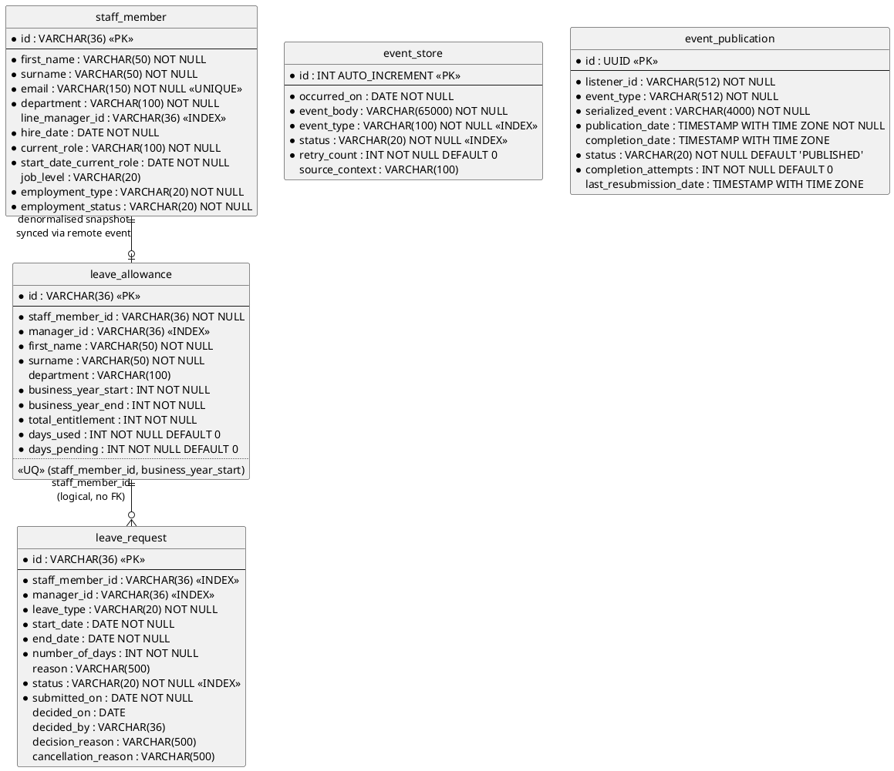
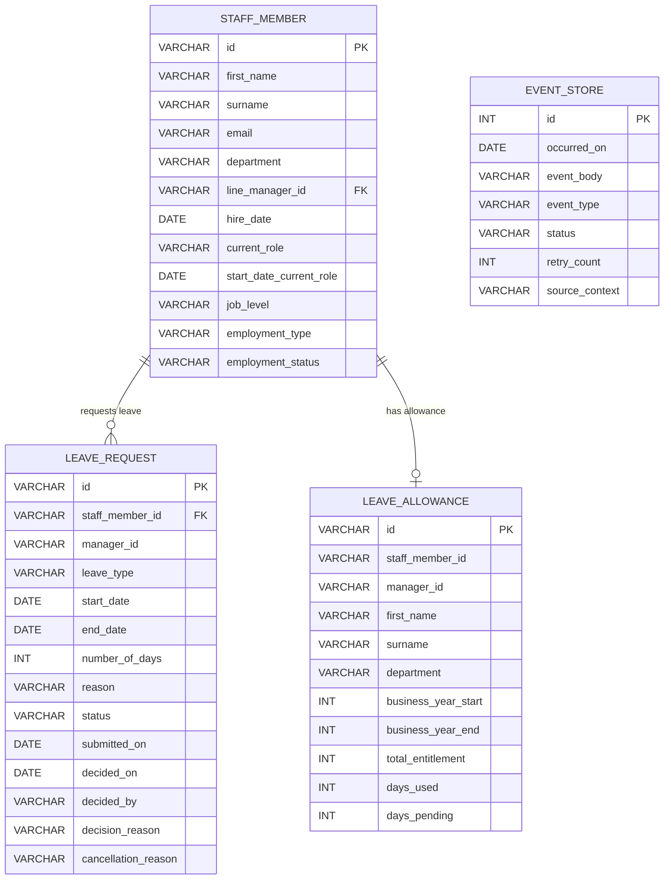
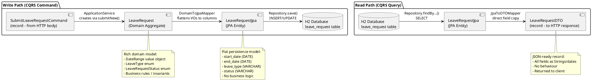

# Database Schema Design — Leave Booking System

**Module:** COMP60047 Enterprise Application Development
**Lecturer:** Phil James — Staffordshire University
**Lecture Alignment:** Lecture 5 (CQRS Queries — schema.sql, data.sql, H2, ERD), Lecture 6 (CQRS Commands — extended schema, VARCHAR(36) PKs), Lecture 7 (event_store + event_publication tables), Lecture 8 (extended event_store with status + retry)

---

## 1. ERD (PlantUML — Crow's Foot Notation)

This follows the ERD style from Lecture 5 (Figure 2) using Crow's Foot notation:



**Mermaid representation:**



### ERD Notes

| Relationship | Description | Why No Hard FK? |
|---|---|---|
| `leave_request` → `leave_allowance` | Linked logically by `staff_member_id` | DDD: no cross-aggregate joins. Each aggregate is its own consistency boundary. Relationship maintained by events. (Lecture 3) |
| `staff_member` → `leave_allowance` | Cross-context. Denormalised snapshot of staff data in allowance. | DDD: no cross-context joins. Data synced via `StaffMemberAddedEvent` / `StaffMemberUpdatedEvent`. (Lecture 8) |
| `event_store` | Shared audit table for all contexts | Records every domain event (local + remote) for debugging and replay |
| `event_publication` | Spring Modulith's internal event registry | Required for `@TransactionalEventListener` to track publication/completion lifecycle |

---

## 2. Data Dictionary

### 2.1 leave_request (Leave Management Context — Core)

| Column | Type | PK/FK | Index | Constraints | Description |
|--------|------|-------|-------|-------------|-------------|
| `id` | VARCHAR(36) | PK | — | NOT NULL, UUID format | Unique identifier. Generated via `Identity.generateId()` in the domain layer — the application owns identity creation, not the DB. |
| `staff_member_id` | VARCHAR(36) | — | YES | NOT NULL | UUID of the staff member who submitted. Cross-aggregate reference to LeaveAllowance. |
| `manager_id` | VARCHAR(36) | — | YES | NOT NULL | UUID of the manager responsible for approval. Denormalised at submission time (captures point-in-time assignment). |
| `leave_type` | VARCHAR(20) | — | — | NOT NULL, CHECK IN ('ANNUAL') | Type of leave. Currently only ANNUAL; extensible to SICK, COMPASSIONATE, etc. Maps to `LeaveType` enum. |
| `start_date` | DATE | — | — | NOT NULL | First day of requested leave (inclusive). Must be in the future at submission time. |
| `end_date` | DATE | — | — | NOT NULL | Last day of requested leave (inclusive). Must be ≥ start_date. |
| `number_of_days` | INT | — | — | NOT NULL, CHECK > 0 | Working days (excludes Sat/Sun). Calculated by `DateRange.workingDays()` at submission. |
| `reason` | VARCHAR(500) | — | — | — | Optional textual reason provided by the staff member. |
| `status` | VARCHAR(20) | — | YES | NOT NULL, CHECK IN ('PENDING','APPROVED','REJECTED','CANCELLED') | Current state in the approval workflow. Mapped to `LeaveRequestStatus` enum. |
| `submitted_on` | DATE | — | — | NOT NULL | Date the request was created. Set to `LocalDate.now()` in `submitNew()`. |
| `decided_on` | DATE | — | — | — | Date the request was approved or rejected. NULL while PENDING. |
| `decided_by` | VARCHAR(36) | — | — | — | UUID of the manager/admin who approved or rejected. NULL while PENDING. |
| `decision_reason` | VARCHAR(500) | — | — | — | Optional reason given by the manager/admin when approving or rejecting. |
| `cancellation_reason` | VARCHAR(500) | — | — | — | Reason for cancellation. NULL unless status = CANCELLED. |

---

### 2.2 leave_allowance (Leave Management Context — Core)

| Column | Type | PK/FK | Index | Constraints | Description |
|--------|------|-------|-------|-------------|-------------|
| `id` | VARCHAR(36) | PK | — | NOT NULL, UUID format | Unique identifier for this allowance record. |
| `staff_member_id` | VARCHAR(36) | — | YES | NOT NULL | UUID of the staff member. Part of composite unique constraint. |
| `manager_id` | VARCHAR(36) | — | YES | NOT NULL | Current line manager. Synced via `StaffMemberUpdatedEvent`. Used for team-level queries. |
| `first_name` | VARCHAR(50) | — | — | NOT NULL | Denormalised snapshot from Staff Management for reporting (no cross-context joins). |
| `surname` | VARCHAR(50) | — | — | NOT NULL | Denormalised snapshot from Staff Management for reporting. |
| `department` | VARCHAR(100) | — | — | — | Denormalised snapshot for department-level filtering. |
| `business_year_start` | INT | — | — | NOT NULL | Start year (e.g. 2026). Part of composite unique constraint. |
| `business_year_end` | INT | — | — | NOT NULL | End year (e.g. 2027). Always `start + 1`. |
| `total_entitlement` | INT | — | — | NOT NULL, CHECK > 0 | Total annual leave days. Default 25. Adjustable by admin via `amendEntitlement()`. |
| `days_used` | INT | — | — | NOT NULL, DEFAULT 0, CHECK ≥ 0 | Days consumed by approved requests. Updated via `confirmDays()`. |
| `days_pending` | INT | — | — | NOT NULL, DEFAULT 0, CHECK ≥ 0 | Days reserved by pending requests. Updated via `reserveDays()`/`releasePendingDays()`. |

**Composite unique constraint:** `(staff_member_id, business_year_start)` — ensures one allowance record per person per year (idempotency guard for duplicate event processing).

---

### 2.3 staff_member (Staff Management Context — Supporting)

| Column | Type | PK/FK | Index | Constraints | Description |
|--------|------|-------|-------|-------------|-------------|
| `id` | VARCHAR(36) | PK | — | NOT NULL, UUID format | Unique staff member identifier. |
| `first_name` | VARCHAR(50) | — | — | NOT NULL | Maps to `FullName.firstName()`. Validated max 50 chars. |
| `surname` | VARCHAR(50) | — | — | NOT NULL | Maps to `FullName.surname()`. Validated max 50 chars. |
| `email` | VARCHAR(150) | — | UNIQUE | NOT NULL | Maps to `Email.address()`. Regex-validated in domain. |
| `department` | VARCHAR(100) | — | — | NOT NULL | Organisational unit (e.g. "Engineering", "Finance"). |
| `line_manager_id` | VARCHAR(36) | — | YES | — | Self-referential (a manager is also a staff member). NULL for top-level. |
| `hire_date` | DATE | — | — | NOT NULL | When hired. Cannot be in the future (`createNew()` validates). |
| `current_role` | VARCHAR(100) | — | — | NOT NULL | Job title (e.g. "Software Engineer"). |
| `start_date_current_role` | DATE | — | — | NOT NULL | When they started this role. |
| `job_level` | VARCHAR(20) | — | — | — | Grade/band (e.g. "L4", "Senior"). Optional. |
| `employment_type` | VARCHAR(20) | — | — | NOT NULL, CHECK IN ('FULL_TIME','PART_TIME','CONTRACT') | Maps to `EmploymentType` enum. |
| `employment_status` | VARCHAR(20) | — | — | NOT NULL, CHECK IN ('ACTIVE','ON_LEAVE','TERMINATED') | Maps to `EmploymentStatus` enum. TERMINATED is terminal. |

---

### 2.4 event_store (Common — Cross-cutting)

| Column | Type | PK/FK | Index | Constraints | Description |
|--------|------|-------|-------|-------------|-------------|
| `id` | INT AUTO_INCREMENT | PK | — | NOT NULL | Surrogate ID assigned by the DB. Returned to `DomainEventManager` and attached to the event via `withId()`. |
| `occurred_on` | DATE | — | — | NOT NULL | When the domain event occurred. |
| `event_body` | VARCHAR(65000) | — | — | NOT NULL | Full JSON serialisation of the event payload. Enables replay/debugging. |
| `event_type` | VARCHAR(100) | — | YES | NOT NULL | Simple class name (e.g. "LeaveRequestApprovedEvent"). Indexed for querying by type. |
| `status` | VARCHAR(20) | — | YES | NOT NULL | Delivery status: LOCAL, PENDING, PUBLISHED, FAILED, UNROUTABLE. |
| `retry_count` | INT | — | — | NOT NULL, DEFAULT 0 | Number of times broker publish was retried. Incremented by `@Recover`. |
| `source_context` | VARCHAR(100) | — | — | — | Which service raised the event (e.g. "LeaveRequestApplicationService"). |

---

### 2.5 event_publication (Common — Spring Modulith Registry)

| Column | Type | PK/FK | Index | Constraints | Description |
|--------|------|-------|-------|-------------|-------------|
| `id` | UUID | PK | — | NOT NULL | Assigned by Spring Modulith. |
| `listener_id` | VARCHAR(512) | — | — | NOT NULL | Fully-qualified method reference of the event listener. |
| `event_type` | VARCHAR(512) | — | — | NOT NULL | Fully-qualified class name of the published event. |
| `serialized_event` | VARCHAR(4000) | — | — | NOT NULL | JSON-serialised event payload (Spring Modulith format). |
| `publication_date` | TIMESTAMP WITH TIME ZONE | — | — | NOT NULL | When published to the in-memory bus. |
| `completion_date` | TIMESTAMP WITH TIME ZONE | — | — | — | When listener confirmed processing. NULL if incomplete. |
| `status` | VARCHAR(20) | — | — | NOT NULL, DEFAULT 'PUBLISHED' | Publication lifecycle status. |
| `completion_attempts` | INT | — | — | NOT NULL, DEFAULT 0 | How many times delivery was attempted. |
| `last_resubmission_date` | TIMESTAMP WITH TIME ZONE | — | — | — | Last retry timestamp. |

**Why this table exists:** Spring Modulith requires an explicit `event_publication` table to track `@TransactionalEventListener` registrations. Without it, events published via `ApplicationEventPublisher` after a `@Transactional` commit cannot be reliably tracked/retried. Phil's Lecture 7 explicitly shows this table being manually created in `schema.sql`.

---

## 3. JPA Entity Mapping (Infrastructure Layer)

Each table has a corresponding JPA entity in the `infrastructure/entities/` package. These are **separate from domain aggregates** — conversion is handled by mapper classes in the application layer (Data Mapper pattern, Lecture 4).

### 3.1 LeaveRequestJpa

```java
/**
 * JPA entity mapped to the leave_request table.
 * This is an infrastructure concern — separate from the domain LeaveRequest aggregate.
 * Conversion between domain and JPA is handled by mappers in the application layer.
 *
 * <p><strong>Lecture 5/6 pattern:</strong> The JPA entity uses Lombok @Getter/@Setter
 * for boilerplate reduction and Jakarta Validation annotations for DB-level constraints.
 * It does NOT contain business logic — that lives exclusively in the domain aggregate.
 *
 * <p><strong>Why separate from domain?</strong> (Lecture 4)
 * <ul>
 *   <li>Domain aggregates have ZERO framework dependencies (pure Java)</li>
 *   <li>JPA entities need @Entity, @Table, @Column — framework-coupled</li>
 *   <li>Separating them means domain logic can be unit-tested without Spring context</li>
 *   <li>Different concerns: domain validates business rules; JPA maps to storage</li>
 * </ul>
 */
@Entity(name = "leave_request")
@Table(name = "leave_request")
@Getter @Setter @ToString
public class LeaveRequestJpa {

    @Id
    @Column(name = "id", length = 36)
    private String id;

    @NotBlank(message = "Staff member ID is required")
    @Column(name = "staff_member_id", nullable = false, length = 36)
    private String staffMemberId;

    @NotBlank(message = "Manager ID is required")
    @Column(name = "manager_id", nullable = false, length = 36)
    private String managerId;

    @NotBlank(message = "Leave type is required")
    @Column(name = "leave_type", nullable = false, length = 20)
    private String leaveType;           // Stored as enum name() string

    @NotNull(message = "Start date is required")
    @Column(name = "start_date", nullable = false)
    private LocalDate startDate;

    @NotNull(message = "End date is required")
    @Column(name = "end_date", nullable = false)
    private LocalDate endDate;

    @Positive(message = "Number of days must be positive")
    @Column(name = "number_of_days", nullable = false)
    private int numberOfDays;

    @Size(max = 500)
    @Column(name = "reason", length = 500)
    private String reason;

    @NotBlank(message = "Status is required")
    @Column(name = "status", nullable = false, length = 20)
    private String status;              // Stored as enum name() string

    @NotNull(message = "Submitted on date is required")
    @Column(name = "submitted_on", nullable = false)
    private LocalDate submittedOn;

    @Column(name = "decided_on")
    private LocalDate decidedOn;

    @Column(name = "decided_by", length = 36)
    private String decidedBy;

    @Size(max = 500)
    @Column(name = "decision_reason", length = 500)
    private String decisionReason;

    @Size(max = 500)
    @Column(name = "cancellation_reason", length = 500)
    private String cancellationReason;
}
```

### 3.2 Data Mapper (Domain ↔ JPA)

The Data Mapper pattern (Lecture 4) converts between domain aggregates and JPA entities. Each mapper is a static utility class with no state:

```java
/**
 * Maps LeaveRequest (domain aggregate) → LeaveRequestJpa (infrastructure).
 * Used by the application service on the write path after aggregate validation.
 *
 * <p><strong>Lecture 4 pattern:</strong> "A Data Mapper is a layer of mappers that
 * moves data between objects and a database while keeping them independent of each
 * other and the mapper itself." — Fowler, PoEAA
 *
 * <p>Note how enums are stored as their name() string and DateRange is decomposed
 * into separate startDate/endDate columns — the JPA entity is a flat representation
 * of the rich domain model.
 */
public class LeaveRequestDomainToJpaMapper {

    public static LeaveRequestJpa toJpa(LeaveRequest domain) {
        Objects.requireNonNull(domain, "LeaveRequest domain entity cannot be null");

        LeaveRequestJpa jpa = new LeaveRequestJpa();
        jpa.setId(domain.id().id());                          // Identity → String
        jpa.setStaffMemberId(domain.staffMemberId());
        jpa.setManagerId(domain.managerId());
        jpa.setLeaveType(domain.leaveType().name());          // Enum → String
        jpa.setStartDate(domain.dateRange().startDate());     // DateRange → flat
        jpa.setEndDate(domain.dateRange().endDate());         // DateRange → flat
        jpa.setNumberOfDays(domain.numberOfDays());
        jpa.setReason(domain.reason());
        jpa.setStatus(domain.status().name());                // Enum → String
        jpa.setSubmittedOn(domain.submittedOn());
        jpa.setDecidedOn(domain.decidedOn());
        jpa.setDecidedBy(domain.decidedBy());
        jpa.setCancellationReason(domain.cancellationReason());
        return jpa;
    }
}
```

```java
/**
 * Maps LeaveRequestJpa (infrastructure) → LeaveRequest (domain aggregate).
 * Uses the reconstitute factory method (read path — no events raised).
 *
 * <p>Note: String → Enum via valueOf(), and separate date columns → DateRange VO.
 */
public class LeaveRequestJpaToDomainMapper {

    public static LeaveRequest toDomain(LeaveRequestJpa jpa) {
        Objects.requireNonNull(jpa, "LeaveRequest JPA entity cannot be null");

        return LeaveRequest.reconstitute(
                Identity.of(jpa.getId()),                     // String → Identity
                jpa.getStaffMemberId(),
                jpa.getManagerId(),
                LeaveType.valueOf(jpa.getLeaveType()),        // String → Enum
                new DateRange(jpa.getStartDate(), jpa.getEndDate()), // flat → VO
                jpa.getNumberOfDays(),
                jpa.getReason(),
                LeaveRequestStatus.valueOf(jpa.getStatus()),  // String → Enum
                jpa.getSubmittedOn(),
                jpa.getDecidedOn(),
                jpa.getDecidedBy(),
                jpa.getCancellationReason()
        );
    }
}
```

---

## 4. schema.sql

This file is loaded by Spring Boot on startup (`spring.sql.init.mode: always` in H2 mode). It creates all tables in the correct order (Lecture 5 pattern):

```sql
-- ============================================================
-- LEAVE MANAGEMENT CONTEXT (CORE)
-- ============================================================

CREATE TABLE leave_allowance (
    id                   VARCHAR(36)  PRIMARY KEY,
    staff_member_id      VARCHAR(36)  NOT NULL,
    manager_id           VARCHAR(36)  NOT NULL,
    first_name           VARCHAR(50)  NOT NULL,
    surname              VARCHAR(50)  NOT NULL,
    department           VARCHAR(100),
    business_year_start  INT          NOT NULL,
    business_year_end    INT          NOT NULL,
    total_entitlement    INT          NOT NULL CHECK (total_entitlement > 0),
    days_used            INT          NOT NULL DEFAULT 0 CHECK (days_used >= 0),
    days_pending         INT          NOT NULL DEFAULT 0 CHECK (days_pending >= 0),
    CONSTRAINT uq_allowance_staff_year UNIQUE (staff_member_id, business_year_start)
);

CREATE INDEX idx_leave_allowance_staff ON leave_allowance(staff_member_id);
CREATE INDEX idx_leave_allowance_manager ON leave_allowance(manager_id);

CREATE TABLE leave_request (
    id                   VARCHAR(36)  PRIMARY KEY,
    staff_member_id      VARCHAR(36)  NOT NULL,
    manager_id           VARCHAR(36)  NOT NULL,
    leave_type           VARCHAR(20)  NOT NULL CHECK (leave_type IN ('ANNUAL')),
    start_date           DATE         NOT NULL,
    end_date             DATE         NOT NULL,
    number_of_days       INT          NOT NULL CHECK (number_of_days > 0),
    reason               VARCHAR(500),
    status               VARCHAR(20)  NOT NULL 
        CHECK (status IN ('PENDING','APPROVED','REJECTED','CANCELLED')),
    submitted_on         DATE         NOT NULL,
    decided_on           DATE,
    decided_by           VARCHAR(36),
    decision_reason      VARCHAR(500),
    cancellation_reason  VARCHAR(500)
);

CREATE INDEX idx_leave_request_staff ON leave_request(staff_member_id);
CREATE INDEX idx_leave_request_manager ON leave_request(manager_id);
CREATE INDEX idx_leave_request_status ON leave_request(status);

-- ============================================================
-- STAFF MANAGEMENT CONTEXT (SUPPORTING)
-- ============================================================

CREATE TABLE staff_member (
    id                      VARCHAR(36)  PRIMARY KEY,
    first_name              VARCHAR(50)  NOT NULL,
    surname                 VARCHAR(50)  NOT NULL,
    email                   VARCHAR(150) NOT NULL UNIQUE,
    department              VARCHAR(100) NOT NULL,
    line_manager_id         VARCHAR(36),
    hire_date               DATE         NOT NULL,
    current_role            VARCHAR(100) NOT NULL,
    start_date_current_role DATE         NOT NULL,
    job_level               VARCHAR(20),
    employment_type         VARCHAR(20)  NOT NULL 
        CHECK (employment_type IN ('FULL_TIME','PART_TIME','CONTRACT')),
    employment_status       VARCHAR(20)  NOT NULL 
        CHECK (employment_status IN ('ACTIVE','ON_LEAVE','TERMINATED'))
);

CREATE INDEX idx_staff_member_manager ON staff_member(line_manager_id);

-- ============================================================
-- COMMON (EVENT INFRASTRUCTURE)
-- ============================================================

CREATE TABLE event_store (
    id              INT AUTO_INCREMENT PRIMARY KEY,
    occurred_on     DATE          NOT NULL,
    event_body      VARCHAR(65000) NOT NULL,
    event_type      VARCHAR(100)  NOT NULL,
    status          VARCHAR(20)   NOT NULL,
    retry_count     INT           NOT NULL DEFAULT 0,
    source_context  VARCHAR(100)
);

CREATE INDEX idx_event_store_type ON event_store(event_type);
CREATE INDEX idx_event_store_status ON event_store(status);

-- Spring Modulith event publication registry
-- Required for @TransactionalEventListener to track publication lifecycle
-- (Lecture 7: Phil explicitly creates this table manually in schema.sql)
CREATE TABLE IF NOT EXISTS event_publication (
    id                      UUID         NOT NULL PRIMARY KEY,
    listener_id             VARCHAR(512) NOT NULL,
    event_type              VARCHAR(512) NOT NULL,
    serialized_event        VARCHAR(4000) NOT NULL,
    publication_date        TIMESTAMP WITH TIME ZONE NOT NULL,
    completion_date         TIMESTAMP WITH TIME ZONE,
    status                  VARCHAR(20)  DEFAULT 'PUBLISHED' NOT NULL,
    completion_attempts     INT          DEFAULT 0 NOT NULL,
    last_resubmission_date  TIMESTAMP WITH TIME ZONE
);
```

---

## 5. data.sql (Seed Data for Development/Testing)

Seed data populates the H2 database on startup for manual testing and Postman verification:

```sql
-- ============================================================
-- STAFF MANAGEMENT CONTEXT — Seed Staff
-- ============================================================
-- These represent staff members already in the system.
-- In production, they would be created via POST /staff (triggering events).

INSERT INTO staff_member (id, first_name, surname, email, department, 
    line_manager_id, hire_date, current_role, start_date_current_role, 
    job_level, employment_type, employment_status)
VALUES
    ('mgr-001', 'Sarah', 'Thompson', 'sarah.thompson@company.com', 
     'Engineering', NULL, '2020-03-15', 'Engineering Manager', 
     '2022-01-01', 'L6', 'FULL_TIME', 'ACTIVE'),
    ('staff-001', 'James', 'Wilson', 'james.wilson@company.com', 
     'Engineering', 'mgr-001', '2022-06-01', 'Software Engineer', 
     '2022-06-01', 'L4', 'FULL_TIME', 'ACTIVE'),
    ('staff-002', 'Emily', 'Chen', 'emily.chen@company.com', 
     'Engineering', 'mgr-001', '2023-01-10', 'Software Engineer', 
     '2023-01-10', 'L4', 'FULL_TIME', 'ACTIVE'),
    ('staff-003', 'David', 'Patel', 'david.patel@company.com', 
     'Engineering', 'mgr-001', '2021-09-01', 'Senior Engineer', 
     '2024-04-01', 'L5', 'FULL_TIME', 'ACTIVE'),
    ('admin-001', 'Rachel', 'Morgan', 'rachel.morgan@company.com', 
     'HR', NULL, '2019-01-05', 'HR Administrator', 
     '2019-01-05', 'L5', 'FULL_TIME', 'ACTIVE');

-- ============================================================
-- LEAVE MANAGEMENT CONTEXT — Seed Allowances (2026-2027)
-- ============================================================
-- In production, these are auto-created by StaffMemberAddedEvent.

INSERT INTO leave_allowance (id, staff_member_id, manager_id, first_name, 
    surname, department, business_year_start, business_year_end, 
    total_entitlement, days_used, days_pending)
VALUES
    ('allow-001', 'staff-001', 'mgr-001', 'James', 'Wilson', 
     'Engineering', 2026, 2027, 25, 5, 3),
    ('allow-002', 'staff-002', 'mgr-001', 'Emily', 'Chen', 
     'Engineering', 2026, 2027, 25, 2, 0),
    ('allow-003', 'staff-003', 'mgr-001', 'David', 'Patel', 
     'Engineering', 2026, 2027, 28, 10, 5),
    ('allow-004', 'mgr-001', NULL, 'Sarah', 'Thompson', 
     'Engineering', 2026, 2027, 30, 8, 0);

-- ============================================================
-- LEAVE MANAGEMENT CONTEXT — Seed Leave Requests
-- ============================================================

INSERT INTO leave_request (id, staff_member_id, manager_id, leave_type, 
    start_date, end_date, number_of_days, reason, status, 
    submitted_on, decided_on, decided_by, cancellation_reason)
VALUES
    ('req-001', 'staff-001', 'mgr-001', 'ANNUAL', '2026-07-14', '2026-07-18', 
     5, 'Summer holiday', 'APPROVED', '2026-06-01', '2026-06-03', 'mgr-001', NULL),
    ('req-002', 'staff-001', 'mgr-001', 'ANNUAL', '2026-09-01', '2026-09-03', 
     3, 'Long weekend', 'PENDING', '2026-08-15', NULL, NULL, NULL),
    ('req-003', 'staff-002', 'mgr-001', 'ANNUAL', '2026-08-05', '2026-08-06', 
     2, 'Personal appointment', 'APPROVED', '2026-07-20', '2026-07-21', 'mgr-001', NULL),
    ('req-004', 'staff-003', 'mgr-001', 'ANNUAL', '2026-12-23', '2026-12-31', 
     5, 'Christmas break', 'PENDING', '2026-08-20', NULL, NULL, NULL),
    ('req-005', 'staff-003', 'mgr-001', 'ANNUAL', '2026-10-14', '2026-10-25', 
     10, 'Annual trip', 'APPROVED', '2026-08-01', '2026-08-02', 'mgr-001', NULL),
    ('req-006', 'staff-001', 'mgr-001', 'ANNUAL', '2026-04-07', '2026-04-11', 
     5, 'Easter break', 'CANCELLED', '2026-03-01', '2026-03-02', 'mgr-001', 
     'Plans changed');
```

---

## 6. Data Flow Through Layers

This diagram shows how data transforms as it moves through the CQRS read and write paths:



**Text representation (Event Store Lifecycle):**

```
Event Status Lifecycle:
═══════════════════════

LOCAL EVENTS:
  append() ──► LOCAL (final — no broker publish needed)

REMOTE EVENTS:
  append() ──► PENDING
                  │
        ┌─────────┼──────────┐
        ▼         ▼          ▼
   PUBLISHED   FAILED    UNROUTABLE
   (success)  (retried)  (no routing config)
                  │
                  ▼
              retry_count++
              (max retries → stays FAILED)
```

**Key insight (Lecture 5):** The read path (query) goes `Database → JPA Entity → DTO` and **never touches the domain aggregate**. This is a fundamental CQRS principle — queries don't need domain logic, so they skip the expensive domain layer entirely. Only commands (writes) go through the domain.

---

## 7. H2 Database Configuration

```yaml
# application.yaml
spring:
  datasource:
    url: jdbc:h2:mem:leavebooking    # In-memory database (resets on restart)
    driver-class-name: org.h2database.Driver
    username: sa
    password:
  h2:
    console:
      enabled: true                    # Access at http://localhost:8900/h2-console
      path: /h2-console
  jpa:
    hibernate:
      ddl-auto: none                   # We manage schema ourselves via schema.sql
    show-sql: false
  sql:
    init:
      mode: always                     # Run schema.sql + data.sql on every startup
```

**Why `ddl-auto: none`?** (Lecture 5)
- We manage the schema explicitly via `schema.sql` — this gives full control over indexes, constraints, and table creation order
- Hibernate's auto-DDL can produce unexpected schemas and doesn't support CHECK constraints properly
- Matches the case-study approach from Lectures 5–8

---

## 8. Accessing the H2 Console

For development/debugging, the H2 web console is available at:

```
URL:       http://localhost:8900/h2-console
JDBC URL:  jdbc:h2:mem:leavebooking
Username:  sa
Password:  (blank)
```

You can run SQL queries directly to inspect data:
```sql
-- Check all leave requests
SELECT * FROM leave_request;

-- Check allowance balance for a specific staff member
SELECT staff_member_id, total_entitlement, days_used, days_pending,
       (total_entitlement - days_used) AS remaining,
       (total_entitlement - days_used - days_pending) AS available
FROM leave_allowance
WHERE staff_member_id = 'staff-001';

-- Check event store for recent events
SELECT id, event_type, status, retry_count, occurred_on 
FROM event_store 
ORDER BY id DESC;
```

---

## 9. Design Justifications

### Why VARCHAR(36) for IDs (not INT AUTO_INCREMENT)?
- UUIDs are generated by the **application** (via `Identity.generateId()`), not the database
- This follows the DDD pattern where the **domain owns identity creation** (Lecture 2)
- UUIDs are globally unique — safe for distributed systems and future microservice extraction
- Matches the Lecture 6 case study where `buyer.id` and `order_from_user.id` became `VARCHAR(36)`

### Why denormalise staff name/department into leave_allowance?
- **DDD principle: no cross-context joins** (Lecture 4)
- Leave Management needs staff names for reporting ("show me James Wilson's remaining leave")
- The denormalised fields are kept in sync via `StaffMemberAddedEvent` and `StaffMemberUpdatedEvent`
- Makes future transition to separate databases (microservice architecture) trivial

### Why a composite unique constraint on (staff_member_id, business_year_start)?
- Ensures exactly one allowance per staff member per business year
- Prevents duplicate creation if `StaffMemberAddedEvent` is processed more than once (idempotency)
- Database-level enforcement as a safety net (belt and braces with domain validation)

### Why indexes on status, staff_member_id, and manager_id?
- `status`: Most common query is "find all PENDING requests for my team" — filtering by status first narrows results dramatically
- `staff_member_id`: "View my requests" and "find allowance for this person" are high-frequency queries
- `manager_id`: "View outstanding requests for my team" — the manager's most frequent action
- Index selection follows the principle of indexing columns that appear in WHERE clauses of frequent queries

### Why no FK from leave_request to leave_allowance?
- They are **separate aggregates** with separate consistency boundaries (Lecture 3)
- The link is by `staff_member_id` value, maintained by application logic and events
- Evans' guidance: aggregate boundaries define transaction scope — a FK would create coupling that violates aggregate independence

### Why store leave_request.manager_id separately?
- Query efficiency: "find all pending requests where I am the manager" is a simple index scan without joining
- Point-in-time correctness: if a staff member's manager changes mid-year, existing pending requests should still route to the **original** manager they were submitted to

### Why event_store uses INT AUTO_INCREMENT (not UUID)?
- Events are always created sequentially — AUTO_INCREMENT provides natural ordering
- The event_store ID is a technical surrogate used only for the `withId()` wither pattern
- It doesn't need to be globally unique (events are never referenced from outside this system)
