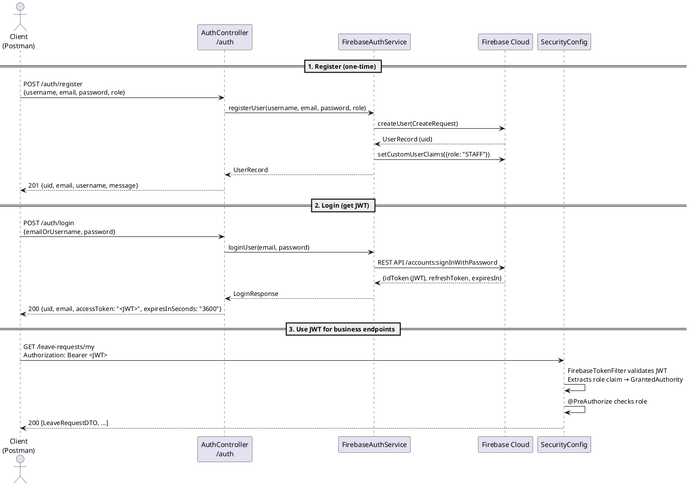
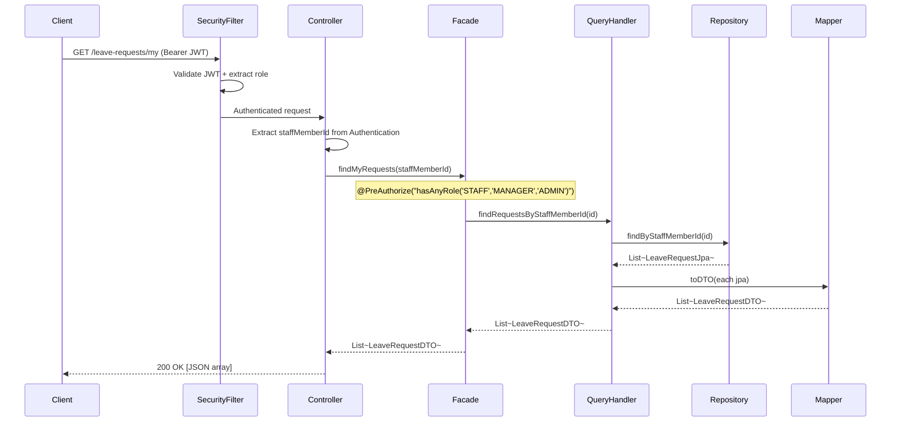
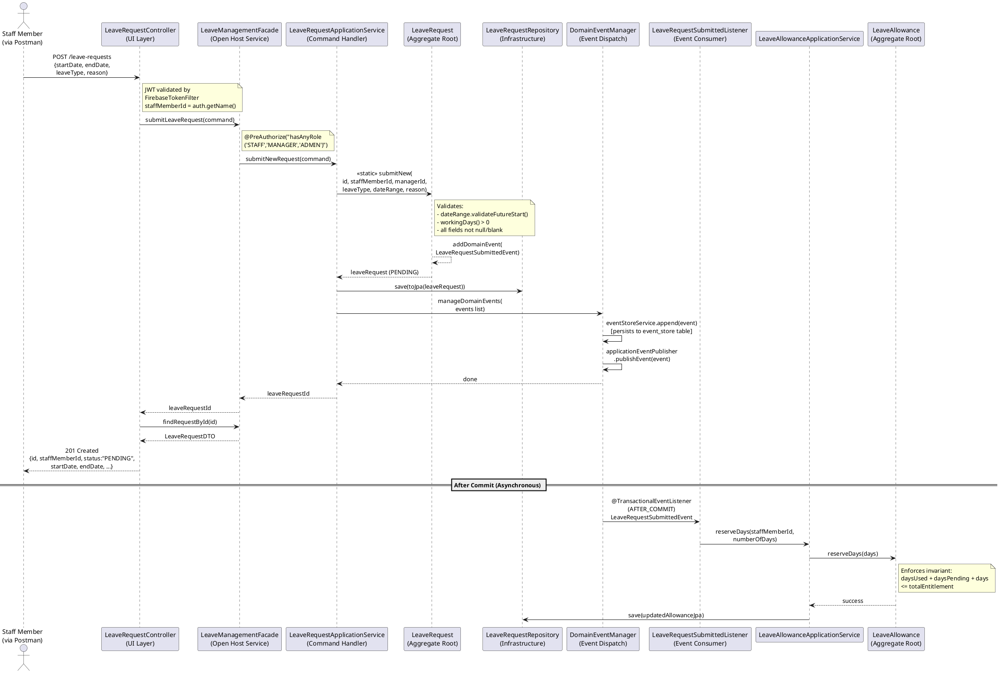
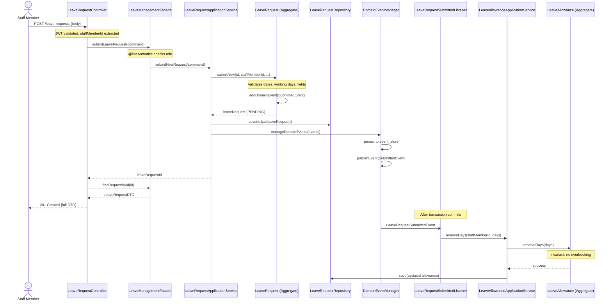
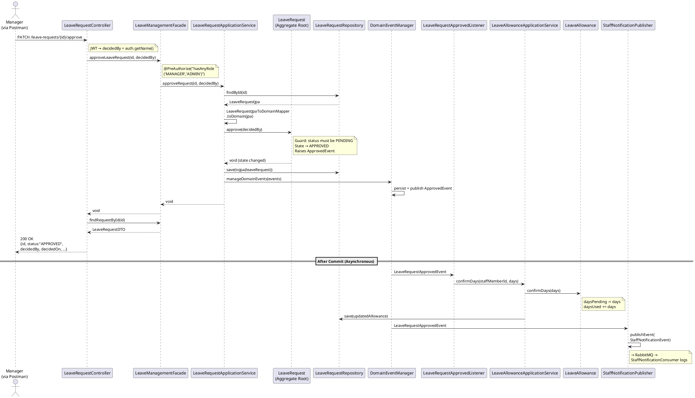
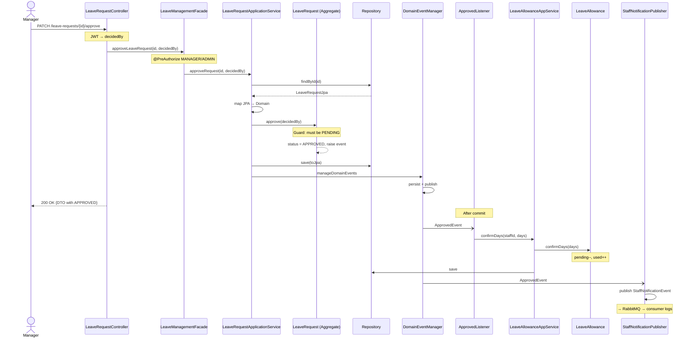
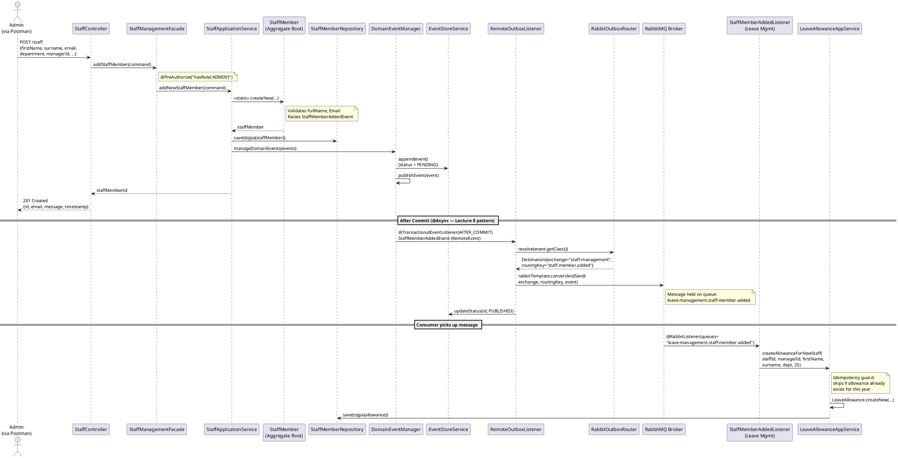
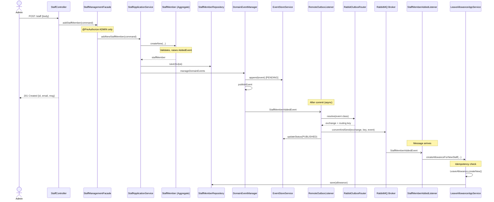

# API Endpoint Design — Leave Booking System

**Module:** COMP60047 Enterprise Application Development
**Lecturer:** Phil James — Staffordshire University
**Lecture Alignment:** Lecture 5 (CQRS Queries — GET endpoints, Postman), Lecture 6 (CQRS Commands — POST endpoints, command records), Lecture 9 (Identity — JWT auth, @PreAuthorize, role-check)
**Base URL:** `http://localhost:8900`

---

## 1. REST API Conventions

| Convention | Implementation | Lecture Reference |
|---|---|---|
| Semantic, plural, kebab-case resource names | `/leave-requests`, `/leave-allowances`, `/staff` | Lecture 5 (controller paths) |
| HTTP verbs: GET (read), POST (create + search), PATCH (partial update) | Brief lists GET/POST/DELETE/PUT/PATCH. We use GET, POST, PATCH. PUT omitted (PATCH is more appropriate for partial updates — see section 13). DELETE omitted for business entities (soft-delete via state machine — see section 13). Only physical deletion is the scheduled event store cleanup (not an API endpoint). | Lectures 5 & 6, RFC 5789, RFC 7231 |
| JSON request and response bodies | `@RequestBody` / `@ResponseBody` via `@RestController` | Lecture 5 |
| Meaningful HTTP status codes | 201 Created, 200 OK, 400 Bad Request, 401/403, 404, 409 Conflict, 429 | Lecture 5 (GlobalExceptionHandler) |
| All endpoints except `/auth/**` require JWT | `SecurityConfig`: `/auth/**` permitAll, else authenticated | Lecture 9 |
| Role-based access via `@PreAuthorize` on facade | `@PreAuthorize("hasAnyRole('ADMIN', 'MANAGER')")` | Lecture 9 |

---

## 2. Authentication Flow (Lecture 9)

Before using any business endpoint, the client must obtain a JWT token:



**Mermaid representation:**



---

## 3. Identity & Access Control (`/auth`)

No authentication required for these endpoints (Spring Security `permitAll`).

| # | Method | Path | Request Body | Success | Errors | Description |
|---|--------|------|-------------|---------|--------|-------------|
| 1 | POST | `/auth/register` | `RegisterRequest` | 201 + `RegisterResponse` | 400 (validation/duplicate email) | Register a new user in Firebase + create skeleton staff record (PENDING_SETUP). Public callers always get STAFF role. Admin callers can assign any role. |
| 2 | POST | `/auth/login` | `LoginRequest` | 200 + `LoginResponse` | 401 (invalid credentials) | Authenticate and receive JWT |
| 3 | GET | `/auth/role-check` | — | 200 + `"{roles} access granted"` | 401 (no/invalid token) | Verify current user's role (requires auth) |
| 3a | GET | `/auth/users/{email}` | — | 200 + `{uid, email, displayName, role}` | 404 (not found) | Look up user UID by email (ADMIN only) |
| 3b | PATCH | `/auth/password` | `{newPassword}` | 200 + `{message}` | 400 (invalid password) | Change own password (any authenticated user) |

### Request/Response Schemas

**RegisterRequest:**
```json
{
  "username": "james.wilson",
  "email": "james.wilson@company.com",
  "password": "SecurePass123!",
  "role": "STAFF"
}
```

**RegisterResponse:**
```json
{
  "uid": "firebase-uid-string",
  "email": "james.wilson@company.com",
  "username": "james.wilson",
  "message": "User created successfully"
}
```

**LoginRequest:**
```json
{
  "emailOrUsername": "james.wilson@company.com",
  "password": "SecurePass123!"
}
```

**LoginResponse:**
```json
{
  "uid": "firebase-uid-string",
  "email": "james.wilson@company.com",
  "username": "james.wilson",
  "accessToken": "eyJhbGciOiJSUzI1NiIsInR5cCI6IkpXVCJ9...",
  "refreshToken": "AMf-vBw4...",
  "expiresInSeconds": "3600"
}
```

### Postman Setup for JWT (Lecture 9 Pattern)

Phil's Lecture 9 shows how to store the JWT in a Postman global variable using the **Scripts** tab:

```javascript
// In Postman: Login request → Scripts → Post-response
const response = pm.response.json();
const token = response.accessToken || response.idToken || response.token;

if (token) {
    pm.globals.set("jwt_token", token);
    console.log("JWT stored successfully");
} else {
    console.error("No token found in response");
}
```

Then on all other collections, set **Authorization → Bearer Token → `{{jwt_token}}`** at the collection level. Every request in the collection inherits the token automatically.

---

## 4. Leave Requests (`/leave-requests`) — Core Context

### 4.1 Queries (Read Operations — CQRS Read Path)

These follow the Lecture 5 pattern: `Controller → Facade → QueryHandler → Repository → JpaToDTOMapper → DTO`

| # | Method | Path | Roles | Parameters | Success | Description |
|---|--------|------|-------|------------|---------|-------------|
| 4 | GET | `/leave-requests/my` | STAFF, MANAGER, ADMIN | — | 200 + `List<LeaveRequestDTO>` | View current user's own requests (unfiltered) |
| 5 | GET | `/leave-requests/team` | MANAGER, ADMIN | — | 200 + `List<LeaveRequestDTO>` | View requests for manager's team (unfiltered) |
| 6 | GET | `/leave-requests/all` | ADMIN | — | 200 + `List<LeaveRequestDTO>` | View all requests company-wide (unfiltered) |
| 7 | GET | `/leave-requests/{id}` | STAFF (own), MANAGER (team), ADMIN | — | 200 + `LeaveRequestDTO` | View a specific request by ID |

### 4.2 Search (Filtered Queries — POST Search Pattern)

Complex filtering is handled via POST endpoints with a structured JSON body rather than query parameters.
This enterprise search pattern (used by Elasticsearch, Stripe, etc.) keeps URLs clean when multiple
optional filters are combined. All filter fields are optional — omit a field or pass null to skip that filter.

| # | Method | Path | Roles | Body Fields | Success | Description |
|---|--------|------|-------|------------|---------|-------------|
| 4a | POST | `/leave-requests/my/search` | STAFF, MANAGER, ADMIN | `status` | 200 + `List<LeaveRequestDTO>` | Search own requests with filters |
| 5a | POST | `/leave-requests/team/search` | MANAGER, ADMIN | `status`, `from`, `to` | 200 + `List<LeaveRequestDTO>` | Search team requests with filters (brief: "could be enhanced with start and end dates") |
| 6a | POST | `/leave-requests/all/search` | ADMIN | `status`, `staffMemberId`, `managerId`, `from`, `to` | 200 + `List<LeaveRequestDTO>` | Search all requests with optional filters. Filter priority: staffMemberId > managerId > company-wide (brief: "filtered by staff member, manager's team or across the company") |

### 4.3 Commands (Write Operations — CQRS Write Path)

These follow the Lecture 6 pattern: `Controller → Facade → ApplicationService → Domain Aggregate → DomainToJpaMapper → Repository`

| # | Method | Path | Roles | Request Body | Success | Errors | Description |
|---|--------|------|-------|-------------|---------|--------|-------------|
| 8 | POST | `/leave-requests` | STAFF, MANAGER, ADMIN | `SubmitLeaveRequestBody` | 201 Created | 400 (validation / no manager / insufficient balance), 409 (date overlap) | Submit new leave request. managerId always resolved from staff record's lineManagerId. Date overlap detection prevents double-booking. Synchronous allowance check prevents over-booking. |
| 9 | PATCH | `/leave-requests/{id}/approve` | MANAGER (assigned), ADMIN | `{"reason?"}` optional | 200 + `LeaveRequestDTO` | 403 (not assigned manager), 404, 409 (not pending) | Approve a pending request. Only the assigned manager or admin. |
| 10 | PATCH | `/leave-requests/{id}/reject` | MANAGER (assigned), ADMIN | `{"reason?"}` optional | 200 + `LeaveRequestDTO` | 403 (not assigned manager), 404, 409 (not pending) | Reject a pending request. Only the assigned manager or admin. |
| 11 | PATCH | `/leave-requests/{id}/cancel` | STAFF (own), ADMIN | `{"reason?"}` optional | 200 + `LeaveRequestDTO` | 403 (not owner), 404, 409 (already terminal) | Cancel own request. Staff can only cancel their own. Admin can cancel any. |

### Request/Response Schemas

**SubmitLeaveRequestBody:**
```json
{
  "startDate": "2026-09-15",
  "endDate": "2026-09-19",
  "leaveType": "ANNUAL",
  "reason": "Family holiday (optional, max 500 chars)"
}
```
> **Notes:**
> - `staffMemberId` is derived from the authenticated user's JWT token — never passed in the body (prevents request forgery).
> - `managerId` is NOT in the body — always resolved from the staff member's assigned `lineManagerId`. If no line manager is assigned, returns 400.
> - `startDate` and `endDate` must be today or in the future.
> - Synchronous allowance sufficiency check: if the staff member doesn't have enough available days, returns 400 before the request is created.
> - Date overlap detection: if the staff member already has a PENDING or APPROVED request covering the same dates, the submission is rejected with 409 Conflict.
> - `reason` is optional (max 500 characters).

**LeaveRequestSearchCriteria (POST /search body):**
```json
{
  "status": "PENDING",
  "staffMemberId": "550e8400-e29b-41d4-a716-446655440000",
  "managerId": "660e8400-e29b-41d4-a716-446655440000",
  "from": "2026-09-01",
  "to": "2026-12-31"
}
```
> **All fields are optional.** Omit a field or pass null to skip that filter. Available fields depend on the endpoint:
> - `/my/search` — `status` only
> - `/team/search` — `status`, `from`, `to`
> - `/all/search` — all 5 fields (admin can filter by any staff member or manager)

**CancelLeaveRequestCommand:**
```json
{
  "reason": "Plans changed"
}
```

**LeaveRequestDTO (response):**
```json
{
  "id": "550e8400-e29b-41d4-a716-446655440000",
  "staffMemberId": "staff-001",
  "managerId": "mgr-001",
  "leaveType": "ANNUAL",
  "startDate": "2026-09-15",
  "endDate": "2026-09-19",
  "numberOfDays": 5,
  "reason": "Family holiday",
  "status": "PENDING",
  "submittedOn": "2026-08-20",
  "decidedOn": null,
  "decidedBy": null,
  "decisionReason": null,
  "cancellationReason": null
}
```

### curl Examples

```bash
# Register a STAFF user
curl -X POST http://localhost:8900/auth/register \
  -H "Content-Type: application/json" \
  -d '{"username":"james.wilson","email":"james@company.com","password":"Pass123!","role":"STAFF"}'

# Login to get JWT
curl -X POST http://localhost:8900/auth/login \
  -H "Content-Type: application/json" \
  -d '{"emailOrUsername":"james@company.com","password":"Pass123!"}'
# → Save the "accessToken" value from the response

# Submit a leave request (using the JWT)
curl -X POST http://localhost:8900/leave-requests \
  -H "Content-Type: application/json" \
  -H "Authorization: Bearer eyJhbGciOi..." \
  -d '{"startDate":"2026-09-15","endDate":"2026-09-19","leaveType":"ANNUAL","reason":"Holiday"}'

# View my leave requests (unfiltered)
curl -X GET http://localhost:8900/leave-requests/my \
  -H "Authorization: Bearer eyJhbGciOi..."

# Search my pending requests only (POST search)
curl -X POST http://localhost:8900/leave-requests/my/search \
  -H "Content-Type: application/json" \
  -H "Authorization: Bearer eyJhbGciOi..." \
  -d '{"status": "PENDING"}'

# Approve a request (as manager)
curl -X PATCH http://localhost:8900/leave-requests/req-002/approve \
  -H "Authorization: Bearer eyJhbGciOi..."

# Cancel a request
curl -X PATCH http://localhost:8900/leave-requests/req-002/cancel \
  -H "Content-Type: application/json" \
  -H "Authorization: Bearer eyJhbGciOi..." \
  -d '{"reason":"Changed plans"}'

# Admin: view all requests company-wide (unfiltered)
curl -X GET http://localhost:8900/leave-requests/all \
  -H "Authorization: Bearer eyJhbGciOi..."  # (ADMIN JWT)

# Search own requests by status (POST search)
curl -X POST http://localhost:8900/leave-requests/my/search \
  -H "Content-Type: application/json" \
  -H "Authorization: Bearer eyJhbGciOi..." \
  -d '{"status": "PENDING"}'

# Search team requests by date range (POST search — manager)
curl -X POST http://localhost:8900/leave-requests/team/search \
  -H "Content-Type: application/json" \
  -H "Authorization: Bearer eyJhbGciOi..." \
  -d '{"status": "PENDING", "from": "2026-09-01", "to": "2026-12-31"}'

# Admin: search all requests for a specific staff member
curl -X POST http://localhost:8900/leave-requests/all/search \
  -H "Content-Type: application/json" \
  -H "Authorization: Bearer eyJhbGciOi..." \
  -d '{"staffMemberId": "550e8400-e29b-41d4-a716-446655440000"}'

# Admin: search pending requests for a specific manager's team
curl -X POST http://localhost:8900/leave-requests/all/search \
  -H "Content-Type: application/json" \
  -H "Authorization: Bearer eyJhbGciOi..." \
  -d '{"managerId": "660e8400-e29b-41d4-a716-446655440000", "status": "PENDING"}'
```

---

## 5. Leave Allowances (`/leave-allowances`) — Core Context

### 5.1 Queries

| # | Method | Path | Roles | Parameters | Success | Description |
|---|--------|------|-------|------------|---------|-------------|
| 12 | GET | `/leave-allowances/my` | STAFF, MANAGER, ADMIN | — | 200 + `LeaveAllowanceDTO` | View own remaining leave |
| 13 | GET | `/leave-allowances/staff/{staffMemberId}` | MANAGER (team), ADMIN | — | 200 + `LeaveAllowanceDTO` | View a specific staff member's allowance |
| 14 | GET | `/leave-allowances/team` | MANAGER, ADMIN | — | 200 + `List<LeaveAllowanceDTO>` | View allowances for team |
| 15 | GET | `/leave-allowances/all` | ADMIN | `department` (optional) | 200 + `List<LeaveAllowanceDTO>` | View all allowances company-wide |

### 5.2 Commands

| # | Method | Path | Roles | Request Body | Success | Description |
|---|--------|------|-------|-------------|---------|-------------|
| 16 | PATCH | `/leave-allowances/{id}` | ADMIN | `{"newEntitlement": 28}` | 200 + `LeaveAllowanceDTO` | Amend total entitlement |

**AmendEntitlementCommand:**
```json
{
  "newEntitlement": 28
}
```

**LeaveAllowanceDTO (response):**
```json
{
  "id": "allow-001",
  "staffMemberId": "staff-001",
  "staffName": "James Wilson",
  "managerId": "mgr-001",
  "department": "Engineering",
  "businessYear": "2026-2027",
  "totalEntitlement": 25,
  "daysUsed": 5,
  "daysPending": 3,
  "remainingDays": 20,
  "availableDays": 17
}
```

> **Derived fields:** `remainingDays = totalEntitlement - daysUsed` and `availableDays = totalEntitlement - daysUsed - daysPending` are calculated at mapping time by `LeaveAllowanceJpaToDTOMapper` — they are not stored in the database.

### curl Examples

```bash
# View my allowance
curl -X GET http://localhost:8900/leave-allowances/my \
  -H "Authorization: Bearer eyJhbGciOi..."

# View a staff member's allowance (as manager/admin)
curl -X GET http://localhost:8900/leave-allowances/staff/staff-001 \
  -H "Authorization: Bearer eyJhbGciOi..."

# Amend entitlement (as admin)
curl -X PATCH http://localhost:8900/leave-allowances/allow-001 \
  -H "Content-Type: application/json" \
  -H "Authorization: Bearer eyJhbGciOi..." \
  -d '{"newEntitlement": 28}'
```

---

## 6. Staff Members (`/staff`) — Supporting Context

| # | Method | Path | Roles | Request Body | Success | Description |
|---|--------|------|-------|-------------|---------|-------------|
| 17 | POST | `/staff` | ADMIN | `AddStaffMemberCommand` (Bean Validated, includes optional `password`, `role`) | 201 + `StaffMemberCreatedResponse` | Creates Firebase user account + staff record (PENDING_SETUP). Domain value objects (FullName, Email) are pre-validated before Firebase call to prevent orphan accounts. Firebase UID = staff record ID. Default password: `Password123!`, default role: `STAFF`. |
| 18 | GET | `/staff` | ADMIN | — | 200 + `List<StaffMemberDTO>` | View all staff (unfiltered) |
| 18a | POST | `/staff/search` | ADMIN | `{"department?", "status?"}` | 200 + `List<StaffMemberDTO>` | Search staff with optional filters. Status validated against EmploymentStatus enum (PENDING_SETUP, ACTIVE, ON_LEAVE, TERMINATED). |
| 19 | GET | `/staff/{id}` | MANAGER (team), ADMIN | — | 200 + `StaffMemberDTO` | View specific staff member |
| 20 | PATCH | `/staff/{id}` | ADMIN | `UpdateStaffBody` (all fields optional including `role`) | 200 + `StaffMemberDTO` | Update any combination of department, placement, status, role. Department changes trigger StaffMemberUpdatedEvent. Status PENDING_SETUP→ACTIVE triggers StaffMemberAddedEvent (creates allowance). Role updates Firebase custom claims. |

### Request/Response Schemas

**AddStaffMemberCommand:**
```json
{
  "firstName": "Alex",
  "surname": "Johnson",
  "email": "alex.johnson@company.com",
  "department": "Engineering",
  "lineManagerId": "mgr-001",
  "hireDate": "2026-09-01",
  "currentRole": "Graduate Engineer",
  "startDateOfCurrentRole": "2026-09-01",
  "jobLevel": "L3",
  "employmentType": "FULL_TIME"
}
```

**UpdateDepartmentCommand:**
```json
{
  "department": "Data Science",
  "lineManagerId": "mgr-002"
}
```

**UpdatePlacementCommand:**
```json
{
  "currentRole": "Senior Engineer",
  "startDateOfCurrentRole": "2026-09-01",
  "jobLevel": "L5",
  "employmentType": "FULL_TIME"
}
```

**UpdateStatusCommand:**
```json
{
  "employmentStatus": "TERMINATED"
}
```

**StaffMemberDTO (response):**
```json
{
  "id": "550e8400-e29b-41d4-a716-446655440000",
  "firstName": "Alex",
  "surname": "Johnson",
  "email": "alex.johnson@company.com",
  "department": "Engineering",
  "lineManagerId": "mgr-001",
  "hireDate": "2026-09-01",
  "currentRole": "Graduate Engineer",
  "startDateOfCurrentRole": "2026-09-01",
  "jobLevel": "L3",
  "employmentType": "FULL_TIME",
  "employmentStatus": "ACTIVE"
}
```

### curl Examples

```bash
# Add a new staff member (as admin)
curl -X POST http://localhost:8900/staff \
  -H "Content-Type: application/json" \
  -H "Authorization: Bearer eyJhbGciOi..." \
  -d '{
    "firstName":"Alex","surname":"Johnson",
    "email":"alex@company.com","department":"Engineering",
    "lineManagerId":"mgr-001","hireDate":"2026-09-01",
    "currentRole":"Graduate","startDateOfCurrentRole":"2026-09-01",
    "jobLevel":"L3","employmentType":"FULL_TIME"
  }'

# Update department + assign manager (triggers StaffMemberUpdatedEvent)
curl -X PATCH http://localhost:8900/staff/staff-001 \
  -H "Content-Type: application/json" \
  -H "Authorization: Bearer eyJhbGciOi..." \
  -d '{"department":"Digital","lineManagerId":"manager-uid-456"}'

# Activate a PENDING_SETUP staff member (triggers allowance creation)
curl -X PATCH http://localhost:8900/staff/staff-001 \
  -H "Content-Type: application/json" \
  -H "Authorization: Bearer eyJhbGciOi..." \
  -d '{"employmentStatus":"ACTIVE"}'

# Terminate a staff member (terminal state)
curl -X PATCH http://localhost:8900/staff/staff-003 \
  -H "Content-Type: application/json" \
  -H "Authorization: Bearer eyJhbGciOi..." \
  -d '{"employmentStatus":"TERMINATED"}'
```

---

## 7. Error Response Format (Global)

All errors return a consistent JSON structure via the `GlobalExceptionHandler` (`@ControllerAdvice`):

```java
/**
 * Centralised exception handler for the entire application.
 * Converts exceptions into consistent JSON error responses.
 *
 * <p><strong>Lecture 5 pattern:</strong> Phil's GlobalExceptionHandler catches
 * specific exceptions and maps them to appropriate HTTP status codes.
 * This prevents stack traces from leaking to clients.
 */
@ControllerAdvice
public class GlobalExceptionHandler {

    @ExceptionHandler(Exception.class)
    public ResponseEntity<Map<String, Object>> handleAllExceptions(Exception ex) {
        // Security exceptions → 401/403
        // AuthorizationDeniedException / AccessDeniedException → 403 Forbidden
        // AuthenticationException → 401 Unauthorized

        // ResponseStatusException → uses the status from the exception (400/403/404/409)

        // Not-found exceptions → 404
        // StaffMemberNotFoundException, LeaveRequestNotFoundException, LeaveAllowanceNotFoundException

        // MethodArgumentNotValidException → 400 (Bean Validation failed, includes field-level errors)
        // ConstraintViolationException → 400 (JPA validation failed)
        // DataIntegrityViolationException → 409 (duplicate record)
        // IllegalArgumentException → 400 (domain validation — DomainAssertions)
        // IllegalStateException → 409 (state machine violation)

        // Everything else → 500 Internal Server Error (unexpected — logged for investigation)
    }
}
```

### Error Response Examples

**400 Bad Request (validation failure):**
```json
{
  "status": 400,
  "error": "Bad Request",
  "message": "Start date must be in the future",
  "timestamp": "2026-08-24T10:30:00.000Z"
}
```

**400 Bad Request (registration — missing fields via Bean Validation):**
```json
{
  "status": 400,
  "error": "Bad Request",
  "message": "Validation failed for one or more fields.",
  "errors": {
    "email": "Email is required",
    "password": "Password must be at least 6 characters",
    "username": "Username is required"
  },
  "timestamp": "2026-08-24T10:30:00.000Z"
}
```

**400 Bad Request (registration — duplicate email):**
```json
{
  "status": 400,
  "error": "Bad Request",
  "message": "A user with email admin@admin.com already exists",
  "timestamp": "2026-08-24T10:30:00.000Z"
}
```

**404 Not Found:**
```json
{
  "status": 404,
  "error": "Not Found",
  "message": "Leave request not found with id: xyz-123",
  "timestamp": "2026-08-24T10:30:00.000Z"
}
```

**409 Conflict (business rule violation):**
```json
{
  "status": 409,
  "error": "Conflict",
  "message": "Insufficient leave balance. Available: 3 days, Requested: 5 days",
  "timestamp": "2026-08-24T10:30:00.000Z"
}
```

**401 Unauthorized (no/invalid token):**
```json
{
  "status": 401,
  "error": "Unauthorized",
  "message": "Full authentication is required to access this resource",
  "timestamp": "2026-08-24T10:30:00.000Z"
}
```

**403 Forbidden (insufficient role):**
```json
{
  "status": 403,
  "error": "Forbidden",
  "message": "Access denied: insufficient privileges",
  "timestamp": "2026-08-24T10:30:00.000Z"
}
```

**429 Too Many Requests (rate limited):**
```json
{
  "status": 429,
  "error": "Too Many Requests",
  "message": "Rate limit exceeded. Try again in 45 seconds.",
  "timestamp": "2026-08-24T10:30:00.000Z"
}
```

---

## 8. Role-Based Access Control (RBAC)

### 8.1 Implementation Pattern (Lecture 9)

Access control is implemented at the **facade level** using Spring Security's `@PreAuthorize`:

```java
/**
 * Open Host Service for the Leave Management module.
 * All public methods are annotated with @PreAuthorize for RBAC enforcement.
 *
 * <p><strong>Lecture 9 pattern:</strong> Phil applies @PreAuthorize to the
 * ContextFacade (not the controller) because the facade is the module's
 * public API. Controllers are just HTTP adapters — role logic belongs at
 * the service boundary.
 *
 * <p><strong>Why facade (not controller)?</strong>
 * If another module ever calls this facade internally, the same security
 * rules apply. Controllers can be replaced (e.g. gRPC adapter) without
 * losing role enforcement.
 */
@Component
public class LeaveManagementFacade {

    @PreAuthorize("hasAnyRole('STAFF', 'MANAGER', 'ADMIN')")
    public LeaveRequestDTO submitLeaveRequest(SubmitLeaveRequestCommand cmd) { ... }

    @PreAuthorize("hasAnyRole('MANAGER', 'ADMIN')")
    public LeaveRequestDTO approveLeaveRequest(String id, String decidedBy) { ... }

    @PreAuthorize("hasAnyRole('MANAGER', 'ADMIN')")
    public LeaveRequestDTO rejectLeaveRequest(String id, String decidedBy) { ... }

    @PreAuthorize("hasAnyRole('STAFF', 'MANAGER', 'ADMIN')")
    public LeaveRequestDTO cancelLeaveRequest(String id, CancelLeaveRequestCommand cmd) { ... }

    @PreAuthorize("hasAnyRole('STAFF', 'MANAGER', 'ADMIN')")
    public List<LeaveRequestDTO> findMyRequests(String staffMemberId, String status) { ... }

    @PreAuthorize("hasAnyRole('MANAGER', 'ADMIN')")
    public List<LeaveRequestDTO> findTeamRequests(String managerId, String status) { ... }

    @PreAuthorize("hasRole('ADMIN')")
    public List<LeaveRequestDTO> findAllRequests(String status) { ... }
}
```

### 8.2 Full Access Control Matrix

| Endpoint | STAFF | MANAGER | ADMIN | Notes |
|----------|:-----:|:-------:|:-----:|-------|
| POST `/auth/register` | permitAll | permitAll | permitAll | No auth required |
| POST `/auth/login` | permitAll | permitAll | permitAll | No auth required |
| GET `/auth/role-check` | ✓ | ✓ | ✓ | isAuthenticated() |
| GET `/auth/users/{email}` | ✗ | ✗ | ✓ | Admin only |
| PATCH `/auth/password` | ✓ | ✓ | ✓ | Any authenticated user (own password only) |
| GET `/leave-requests/my` | ✓ (own) | ✓ (own) | ✓ (own) | Scoped by JWT staffMemberId |
| POST `/leave-requests/my/search` | ✓ (own) | ✓ (own) | ✓ (own) | Status filter only. Rejects staffMemberId/managerId (scope from JWT) |
| GET `/leave-requests/team` | ✗ | ✓ (own team) | ✓ (all) | Scoped by JWT managerId |
| POST `/leave-requests/team/search` | ✗ | ✓ (own team) | ✓ (all) | Status + date range. Rejects staffMemberId/managerId (scope from JWT) |
| GET `/leave-requests/all` | ✗ | ✗ | ✓ | Company-wide |
| POST `/leave-requests/all/search` | ✗ | ✗ | ✓ | Status, staffMemberId OR managerId (mutually exclusive), date range |
| GET `/leave-requests/{id}` | ✓ | ✓ | ✓ | Any authenticated user (write ops enforce ownership) |
| POST `/leave-requests` | ✓ | ✓ | ✓ | staffMemberId from JWT |
| PATCH `.../approve` | ✗ | ✓ (assigned) | ✓ | Only assigned manager or admin |
| PATCH `.../reject` | ✗ | ✓ (assigned) | ✓ | Only assigned manager or admin |
| PATCH `.../cancel` | ✓ (own) | ✓ (own) | ✓ | Own requests only (unless admin) |
| GET `/leave-allowances/my` | ✓ | ✓ | ✓ | Own allowance |
| GET `/leave-allowances/staff/{id}` | ✗ | ✓ (team) | ✓ | Team member check |
| GET `/leave-allowances/team` | ✗ | ✓ | ✓ | Team-scoped |
| GET `/leave-allowances/all` | ✗ | ✗ | ✓ | Admin only |
| PATCH `.../entitlement` | ✗ | ✗ | ✓ | Admin only |
| POST `/staff` | ✗ | ✗ | ✓ | Admin only |
| POST `/staff/search` | ✗ | ✗ | ✓ | Admin only |
| GET `/staff` | ✗ | ✗ | ✓ | Admin only |
| GET `/staff/{id}` | ✗ | ✓ (team) | ✓ | Team check |
| PATCH `/staff/{id}` | ✗ | ✗ | ✓ | Admin only — unified update |

### 8.3 SecurityConfig

```java
/**
 * Spring Security configuration.
 *
 * <p><strong>Lecture 9 pattern:</strong>
 * - CSRF disabled (stateless JWT auth)
 * - /auth/** endpoints are permitAll (registration + login)
 * - All other endpoints require authentication
 * - OAuth2 Resource Server validates JWTs using Firebase's JWKS endpoint
 * - Custom JWT converter extracts role claim → GrantedAuthority
 */
@Configuration
@EnableWebSecurity
@EnableMethodSecurity       // Enables @PreAuthorize annotations
@AllArgsConstructor
public class SecurityConfig {

    private final Converter<Jwt, AbstractAuthenticationToken> jwtConverter;

    @Bean
    public SecurityFilterChain filterChain(HttpSecurity http) throws Exception {
        http
            .csrf(csrf -> csrf.disable())      // JWT = stateless, no CSRF needed
            .authorizeHttpRequests(auth -> auth
                .requestMatchers("/auth/**").permitAll()
                .requestMatchers("/h2-console/**").permitAll()
                .anyRequest().authenticated()
            )
            .oauth2ResourceServer(oauth2 -> oauth2
                .jwt(jwt -> jwt.jwtAuthenticationConverter(jwtConverter))
            );
        return http.build();
    }
}
```

---

## 9. Rate Limiting (Brief Requirement)

> "The system will limit the number of requests from a specific end point." — Assessment Brief

| Endpoint | Rate Limit | Window | Status on Exceed |
|---|---|---|---|
| POST `/auth/login` | 20 requests | per minute per IP | 429 Too Many Requests |

### Implementation (Bucket4j)

```java
/**
 * Rate-limiting filter for the login endpoint.
 * Protects against brute-force password attacks.
 *
 * <p>Uses Bucket4j (token-bucket algorithm):
 * - Each IP gets a bucket with 20 tokens
 * - Tokens refill at 20 per minute
 * - When empty, returns 429 until tokens refill
 *
 * <p><strong>Why only login?</strong> The brief says "limit the number of requests
 * from a specific end point" (singular). Login is the highest-risk endpoint for
 * brute-force attacks. All other endpoints are already protected by JWT — rate
 * limiting them adds minimal security value.
 */
@Component
public class RateLimitFilter extends OncePerRequestFilter {

    private final Map<String, Bucket> buckets = new ConcurrentHashMap<>();

    @Override
    protected void doFilterInternal(HttpServletRequest request,
                                     HttpServletResponse response,
                                     FilterChain chain) throws ... {
        if (isLoginEndpoint(request)) {
            String clientIp = request.getRemoteAddr();
            Bucket bucket = buckets.computeIfAbsent(clientIp, this::createBucket);
            
            if (bucket.tryConsume(1)) {
                chain.doFilter(request, response);  // Allow
            } else {
                response.setStatus(429);
                response.getWriter().write(/* 429 JSON response */);
            }
        } else {
            chain.doFilter(request, response);      // Non-login: pass through
        }
    }

    private Bucket createBucket(String key) {
        return Bucket.builder()
                .addLimit(Bandwidth.classic(5, Refill.intervally(5, Duration.ofMinutes(1))))
                .build();
    }
}
```

---

## 10. Security Headers (Brief Requirement)

> "The system will adjust its HTTP headers so that the server version is obfuscated." — Assessment Brief

```java
/**
 * Removes server identification headers and adds security-hardening headers.
 * Prevents attackers from fingerprinting the technology stack.
 */
@Component
public class SecurityHeadersFilter extends OncePerRequestFilter {

    @Override
    protected void doFilterInternal(HttpServletRequest request,
                                     HttpServletResponse response,
                                     FilterChain chain) throws ... {
        // Remove identifying headers
        response.setHeader("Server", "");
        response.setHeader("X-Powered-By", "");
        
        // Add security headers
        response.setHeader("X-Content-Type-Options", "nosniff");
        response.setHeader("X-Frame-Options", "DENY");
        response.setHeader("Strict-Transport-Security", "max-age=31536000");
        
        chain.doFilter(request, response);
    }
}
```

---

## 11. Unauthorised Access Logging (Brief Requirement)

> "A log should be kept of unauthorised access to end points." — Assessment Brief

```java
/**
 * Logs all 401 (Unauthorized) and 403 (Forbidden) responses with:
 * - Timestamp
 * - Requested endpoint and HTTP method
 * - IP address
 * - Token subject (uid) if token present but role insufficient
 * - Reason (expired, invalid, insufficient role)
 *
 * Registered in SecurityConfig as both AuthenticationEntryPoint (401)
 * and AccessDeniedHandler (403).
 */
@Component
@Slf4j
public class UnauthorisedAccessLogger implements 
        AuthenticationEntryPoint, AccessDeniedHandler {

    @Override
    public void commence(HttpServletRequest request, HttpServletResponse response,
                         AuthenticationException ex) {
        log.warn("UNAUTHORIZED ACCESS [401]: {} {} from IP={}, reason={}",
                request.getMethod(), request.getRequestURI(),
                request.getRemoteAddr(), ex.getMessage());
        // Return 401 JSON response
    }

    @Override
    public void handle(HttpServletRequest request, HttpServletResponse response,
                       AccessDeniedException ex) {
        String userId = extractUserId(request);
        log.warn("ACCESS DENIED [403]: {} {} from IP={}, user={}, reason={}",
                request.getMethod(), request.getRequestURI(),
                request.getRemoteAddr(), userId, ex.getMessage());
        // Return 403 JSON response
    }
}
```

---

## 12. Complete Postman Testing Workflow

### Step 1: Register Users (3 roles)

```
POST /auth/register → {username:"admin1", email:"admin@co.com", password:"Pass123!", role:"ADMIN"}
POST /auth/register → {username:"manager1", email:"mgr@co.com", password:"Pass123!", role:"MANAGER"}
POST /auth/register → {username:"staff1", email:"staff@co.com", password:"Pass123!", role:"STAFF"}
```

### Step 2: Login (store token)

```
POST /auth/login → {emailOrUsername:"admin@co.com", password:"Pass123!"}
→ Scripts tab: pm.globals.set("jwt_admin_token", response.accessToken)

POST /auth/login → {emailOrUsername:"mgr@co.com", password:"Pass123!"}
→ Scripts tab: pm.globals.set("jwt_manager_token", response.accessToken)

POST /auth/login → {emailOrUsername:"staff@co.com", password:"Pass123!"}
→ Scripts tab: pm.globals.set("jwt_staff_token", response.accessToken)
```

### Step 3: Test Business Endpoints

```
# As ADMIN: Add a staff member (creates allowance via remote event)
POST /staff → Authorization: Bearer {{jwt_admin_token}}
→ Verify: check leave_allowance table for new record

# As STAFF: Submit a leave request
POST /leave-requests → Authorization: Bearer {{jwt_staff_token}}
→ Verify: status=PENDING, leave_allowance.days_pending increased

# As MANAGER: View team's pending requests
POST /leave-requests/team/search → Authorization: Bearer {{jwt_manager_token}}
Body: {"status": "PENDING"}

# As MANAGER: Approve a request
PATCH /leave-requests/{id}/approve → Authorization: Bearer {{jwt_manager_token}}
→ Verify: status=APPROVED, days_pending decreased, days_used increased

# As STAFF: View remaining leave
GET /leave-allowances/my → Authorization: Bearer {{jwt_staff_token}}
→ Verify: remainingDays and availableDays reflect the approval
```

### Step 4: Test Error Cases

```
# 401: No token
GET /leave-requests/my → (no Authorization header) → expect 401

# 403: Wrong role
POST /staff → Authorization: Bearer {{jwt_staff_token}} → expect 403

# 409: Insufficient balance
POST /leave-requests → (request 30 days when only 17 available) → expect 409

# 409: Invalid state transition
PATCH /leave-requests/{id}/approve → (already approved request) → expect 409

# 429: Rate limit
POST /auth/login (6 times rapidly) → 6th request expect 429
```

---

## 13. Design Justifications

### Why PATCH (not PUT) for approve/reject/cancel?

The assignment brief states: *"Apply clear, semantic URL paths and HTTP verbs (GET, POST, DELETE, PUT, PATCH)."* This lists five verbs as available options. Our API uses GET, POST, and PATCH — but deliberately omits PUT. Here is why:

- **PUT means "replace the entire resource"** (RFC 7231 §4.3.4). A PUT request sends a complete representation of the resource, and the server replaces the stored version entirely. None of our update operations replace an entire entity — they change specific fields:
  - Approve: changes `status` to APPROVED, sets `decidedBy` and `decidedOn` — other fields unchanged
  - Reject: changes `status` to REJECTED, sets `decidedBy` and `decidedOn` — other fields unchanged
  - Cancel: changes `status` to CANCELLED, sets `cancellationReason` — other fields unchanged
  - Amend entitlement: changes `totalEntitlement` only — balance fields unchanged
  - Update department: changes `department` and `lineManagerId` only — identity/placement unchanged

- **PATCH means "apply partial modifications"** (RFC 5789). This is semantically correct for all our update operations — we send only the fields being changed, not the entire resource.

- **The sub-resource style** (`/leave-requests/{id}/approve`) makes the intent explicit. This is a widely adopted REST convention for state-machine transitions — GitHub uses `PUT /pulls/{id}/merge`, Stripe uses `POST /charges/{id}/capture`. Our pattern is consistent with industry practice.

- **If we used PUT**, the client would need to send every field of the LeaveRequest (staffMemberId, managerId, leaveType, startDate, endDate, numberOfDays, reason, status, submittedOn, decidedOn, decidedBy, cancellationReason) just to change the status. This creates unnecessary coupling between the client and the full resource schema, and risks accidental data corruption if the client sends stale values for fields it didn't intend to change.

- **Phil's lecture pattern:** The case study in Lectures 5 and 6 does not use PUT — all updates in the case study are partial (add a delivery address, add a new order). PATCH aligns with the module's approach.

### Why no DELETE API endpoints?

The assignment brief lists DELETE as an available HTTP verb. Our API has **zero DELETE endpoints** — all data removal is handled through state-machine transitions or scheduled infrastructure cleanup. This is a deliberate design decision:

**For business entities (leave requests, staff members, allowances):**

| Entity | Instead of DELETE we use... | Why |
|--------|---------------------------|-----|
| LeaveRequest | `PATCH /{id}/cancel` → status = CANCELLED | Leave requests are auditable business events. Once submitted, they represent something that *happened*. Deleting would break the audit trail and corrupt allowance balance calculations. Cancellation preserves the record while marking it as void. |
| StaffMember | `PATCH /{id}/status` → status = TERMINATED | Staff members are never "deleted" from an enterprise HR system. Termination is a one-way lifecycle state (enforced by the aggregate — cannot transition out of TERMINATED). Their leave history, allowance records, and manager assignments must be preserved for compliance. |
| LeaveAllowance | Not deleted — historical record | Allowances represent annual entitlement for a business year. They persist for historical reporting and final pay calculations. New business years create new allowances rather than deleting old ones. |

**For infrastructure (event store):**

The **only physical deletion** in the system is the `EventStoreCleanupJob` — a scheduled background task that purges PUBLISHED and LOCAL events older than 30 days. This is not exposed as an API endpoint because:
- It's infrastructure housekeeping, not a user-facing operation
- It runs automatically on a cron schedule (`0 0 2 * * *` — daily at 2am)
- FAILED and PENDING events are never purged — they require investigation

**The lecturer's guidance explicitly supports this approach:** *"Not necessary to perform CRUD for everything as deletion might not be a good idea in some situations."* For an enterprise HR/leave system, hard deletion is inappropriate for every business entity. The guidance further states: *"But identify how data is created, read, updated and deleted — use the core domain to discuss this"* — which we do comprehensively in Section 14 (CRUD Operations).

**Enterprise industry practice:** Major HR and ERP systems (SAP SuccessFactors, Workday, BambooHR) use soft-delete patterns for employee and leave records. Physical deletion violates the Working Time Regulations 1998 (reg. 9) which requires retention of working time records. Our approach mirrors real-world enterprise standards.

### Why derive staffMemberId from JWT (not accept in body)?
- **Security:** prevents request forgery — a staff member cannot submit on behalf of someone else.
- The JWT's custom claims (set during Firebase registration) contain the user's staffMemberId.
- Admin override: admins can optionally work with any staff member's data.

### Why separate `/my`, `/team`, `/all` endpoints (not one with filters)?
- **Role enforcement is cleaner:** each endpoint's `@PreAuthorize` is simple and specific
- **Prevents data leakage:** a STAFF user cannot guess query parameters to see other users' data
- **Clear intent:** each path communicates its scope immediately

### Why 409 Conflict for business rule violations (not 400)?
- **400 Bad Request** = malformed input (invalid JSON, missing required fields)
- **409 Conflict** = well-formed request that violates a business invariant (insufficient balance, invalid state transition)
- This distinction aids API consumers in handling errors programmatically

### Why rate-limit only login?
- Brief says "limit requests from a **specific** end point" (singular)
- Login is highest-risk for brute-force attacks
- All other endpoints are already JWT-protected — rate limiting adds minimal value
- Focused approach demonstrates understanding without over-engineering

### Why POST search endpoints instead of GET with query parameters?
The API uses two conventions for read operations:
- **GET endpoints** for simple, unfiltered reads (e.g. `GET /leave-requests/my`, `GET /leave-requests/all`)
- **POST /search endpoints** for filtered queries with a structured JSON body (e.g. `POST /leave-requests/all/search`)

**Why not just use GET with query parameters like `?status=PENDING&from=2026-09-01&to=2026-12-31`?**

1. **Clean URL separation:** GET endpoints are simple and predictable — they always return everything. Filtering is a separate concern handled by dedicated search endpoints. No ambiguity about which params are supported on which endpoint.
2. **Structured filter body:** A JSON body like `{"status": "PENDING", "from": "2026-09-01", "to": "2026-12-31"}` is self-documenting and type-safe. Date fields are parsed as `LocalDate` automatically by Jackson. Query params would require manual string-to-date parsing.
3. **Extensibility:** Adding new filters (e.g. `leaveType`, `department`) only requires adding a field to the `LeaveRequestSearchCriteria` record — no URL changes, no query param parsing logic.
4. **Enterprise convention:** POST search is a well-established pattern in enterprise APIs (Elasticsearch `_search`, Stripe list endpoints, AWS CloudWatch `filter-log-events`). It demonstrates awareness of industry practices beyond basic REST.

**Why not use POST for everything (including unfiltered reads)?** That would deviate from REST conventions where GET means "retrieve a resource." The GET endpoints are kept for unfiltered reads because they are idempotent, cacheable, and bookmarkable — properties that POST lacks. The hybrid approach takes the best of both conventions.


---

## 14. CRUD Operations — Core Domain Discussion

The assignment guidance states: *"Not necessary to perform CRUD for everything as deletion might not be a good idea in some situations. But identify how data is created, read, updated and deleted — use the core domain to discuss this."*

Below is the complete CRUD analysis for the core domain (Leave Management):

### 14.1 Leave Request

| Operation | How It's Done | Endpoint / Mechanism | Justification |
|-----------|---------------|---------------------|---------------|
| **Create** | Staff submits a new leave request | `POST /leave-requests` → `LeaveRequest.submitNew()` → persisted to `leave_request` table with status PENDING | Standard creation via command pattern (Lecture 6). Domain aggregate validates invariants before persistence. |
| **Read** | Staff/manager/admin queries requests | `GET /leave-requests/my`, `/team`, `/all`, `/{id}` → query handlers → `LeaveRequestJpaToDTOMapper` | CQRS read path (Lecture 5). Separate query handlers bypass the domain layer for efficiency. |
| **Update** | State machine transitions | `PATCH /leave-requests/{id}/approve\|reject\|cancel` → loads aggregate → validates state transition → persists → dispatches events | Partial updates via PATCH (RFC 5789). Each transition is a domain command that enforces business rules. Only specific fields change (status, decidedBy, decidedOn, cancellationReason). |
| **Delete** | **Not implemented — by design** | N/A | Leave requests are auditable business events. Once submitted, they represent something that *happened*. Cancellation (status = CANCELLED) is the domain-appropriate alternative to deletion. Hard-deleting would: (1) break the audit trail, (2) corrupt leave allowance balance calculations, (3) violate enterprise compliance requirements for record retention. |

### 14.2 Leave Allowance

| Operation | How It's Done | Endpoint / Mechanism | Justification |
|-----------|---------------|---------------------|---------------|
| **Create** | Automatically via remote event | `StaffMemberAddedEvent` → RabbitMQ → `StaffMemberAddedListener` → `createAllowanceForNewStaff()` | Event-driven creation (Lecture 8 pattern). Not exposed as a direct endpoint — an allowance cannot exist without a staff member. Idempotency guard prevents duplicates. |
| **Read** | Staff/manager/admin queries balances | `GET /leave-allowances/my`, `/staff/{id}`, `/team`, `/all` → query handlers → DTO mappers | Supports the brief's requirement: "View remaining annual leave and/or days used." |
| **Update** | Via local events + admin command | Local events: `reserveDays()`, `confirmDays()`, `releasePendingDays()`, `creditBackDays()` (driven by LeaveRequest state changes). Admin: `PATCH /leave-allowances/{id}` with `{"newEntitlement": 28}` | Balances are updated reactively via domain events (Lecture 7 pattern). Admin entitlement changes are the only direct user-initiated update. |
| **Delete** | **Not implemented — by design** | N/A | An allowance represents a staff member's annual leave entitlement for a business year. Deleting it would: (1) make the staff member unable to request leave, (2) orphan any leave requests referencing their balance, (3) lose historical data needed for final pay calculations when staff are terminated. When a new business year begins, a new allowance is created — old ones persist as historical records. |

### 14.3 Staff Member (Supporting Context)

| Operation | How It's Done | Endpoint / Mechanism | Justification |
|-----------|---------------|---------------------|---------------|
| **Create** | Admin adds a new staff member OR user self-registers | Admin: `POST /staff` creates full record (status: PENDING_SETUP). Self-registration: `POST /auth/register` creates Firebase user + skeleton staff record (status: PENDING_SETUP, department: Unassigned). | Two creation paths. Admin provides all details upfront. Self-registered users get a skeleton record. Admin fills in details via `PATCH /staff/{id}` then activates. |
| **Read** | Admin/manager queries staff | `GET /staff`, `/staff/{id}`, query by `?department=` or `?status=`. `GET /staff?status=PENDING_SETUP` shows unactivated staff. | Standard CQRS queries. |
| **Update** | Admin amends department/placement/status in single request | `PATCH /staff/{id}` with any combination of fields (all optional). Department changes trigger `StaffMemberUpdatedEvent`. Status change PENDING_SETUP to ACTIVE triggers `StaffMemberAddedEvent` (creates leave allowance with correct dept/manager). | Unified PATCH endpoint. Internally routes to separate domain aggregate methods based on which fields are present. |
| **Delete** | **Not implemented — soft-delete via TERMINATED status** | `PATCH /staff/{id}` with `{"employmentStatus": "TERMINATED"}` | Staff members are never hard-deleted. TERMINATED is a terminal state enforced by the aggregate. Leave history, allowances, and manager assignments preserved. |

### 14.4 Event Store (Infrastructure — the ONLY DELETE in the system)

| Operation | How It's Done | Endpoint / Mechanism | Justification |
|-----------|---------------|---------------------|---------------|
| **Create** | Automatically by `DomainEventManager` when any aggregate raises a domain event | `EventStoreService.append(event, sourceContext)` — no direct endpoint | Infrastructure concern — outbox pattern (Lecture 8). Every event is persisted for delivery tracking and audit. |
| **Read** | Internally by `RemoteOutboxListener` to route events, and by cleanup job to find old entries | No public endpoint — internal queries only | Not exposed to users. Used by the outbox mechanism and scheduled jobs. |
| **Update** | Status transitions: PENDING → PUBLISHED/FAILED/UNROUTABLE | `EventStoreService.updateStatus(id, status, incrementRetry)` — called by `RemoteOutboxListener` | Tracks delivery lifecycle — essential for retry and dead-letter handling. |
| **Delete** | **Scheduled cleanup job purges old PUBLISHED and LOCAL events after 30 days** | `EventStoreCleanupJob` (`@Scheduled(cron = "0 0 2 * * *")`) → `EventStoreService.purgeOldEvents(30)` | This is the **only DELETE** in the entire system. Justified because: (1) event_store is infrastructure, not business data; (2) once PUBLISHED, the broker has delivered the message — the local copy has no further purpose; (3) without cleanup, the table grows indefinitely degrading performance; (4) FAILED/PENDING events are **never** purged — they require investigation. |

### 14.5 Summary: Why No Hard DELETE Anywhere Else?

The Leave Booking System is an **enterprise HR application** where every record has audit, compliance, and referential significance. The guidance explicitly acknowledges that *"deletion might not be a good idea in some situations"* — and for an HR/leave system, it's not appropriate for **any** core entity because:

1. **Audit trail** — regulators and HR departments need complete history (who requested what, who approved, when, how many days)
2. **Referential integrity** — leave requests reference staff members, allowances reference staff members, allowances are updated by leave request events. Deleting any entity in this chain breaks others.
3. **Compliance** — UK employment law requires retention of working time records (Working Time Regulations 1998, reg. 9)
4. **Domain semantics** — in the ubiquitous language, staff don't get "deleted" (they get *terminated*), leave requests don't get "deleted" (they get *cancelled*), and allowances don't get "deleted" (they expire at year-end and new ones are created)

The appropriate pattern is **state-machine lifecycle management** — entities move through states (ACTIVE→TERMINATED, PENDING→CANCELLED) rather than being physically removed. This is standard practice in enterprise systems and aligns with the DDD principle that aggregates enforce invariants including lifecycle rules.

---

## 15. Behavioural Sequence Diagrams

The mark scheme states: *"Use appropriate diagrams e.g. class and **sequence** to help illustrate"* the architecture and responsibilities. Below are three key sequence diagrams covering the primary command flows.

### 15.1 Submit Leave Request (Staff → LeaveRequest → LeaveAllowance)

This is the most complex flow — it involves a command, domain validation, event dispatch, and a listener updating a second aggregate.



**Mermaid representation:**



---

### 15.2 Approve Leave Request (Manager → LeaveRequest → LeaveAllowance)



**Mermaid representation:**



---

### 15.3 Staff Member Added (Admin → StaffMember → RabbitMQ → LeaveAllowance)

This demonstrates the **cross-context remote event** flow via the Outbox pattern (Lecture 8).



**Mermaid representation:**


