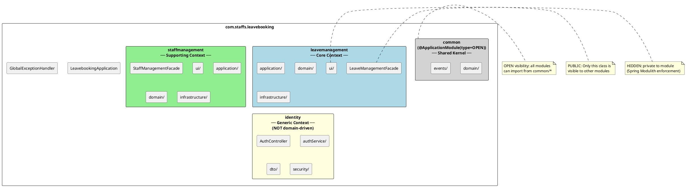
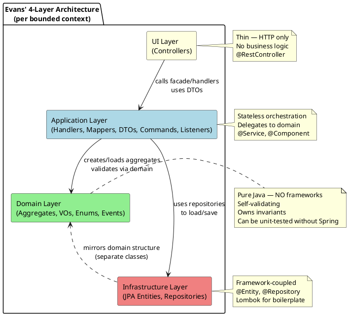
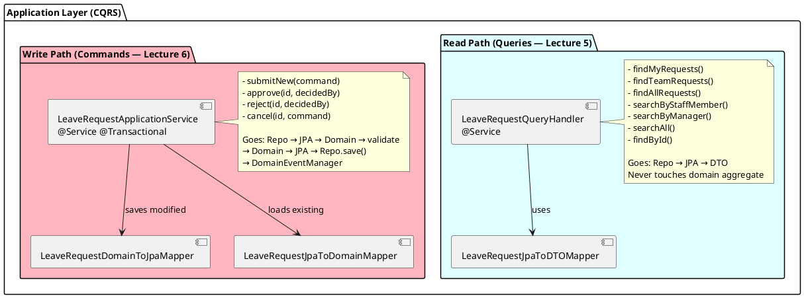
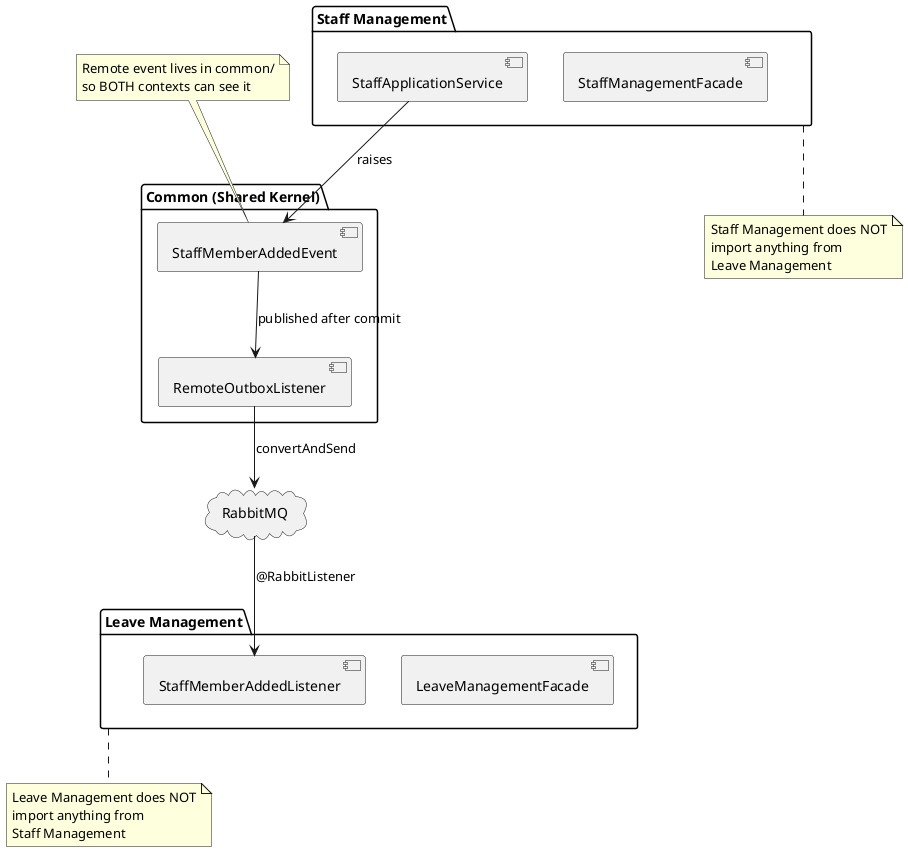
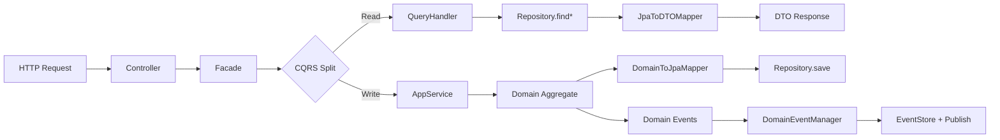
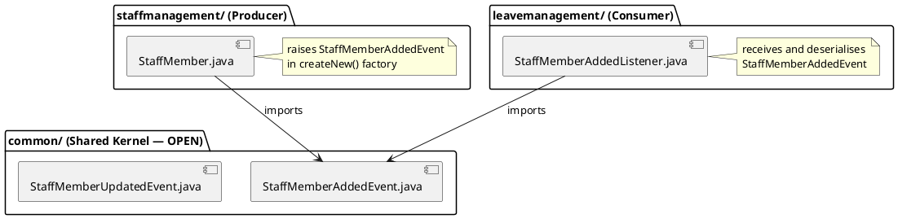

# Folder Structure Design — Leave Booking System

**Module:** COMP60047 Enterprise Application Development
**Lecturer:** Phil James — Staffordshire University
**Lecture Alignment:** Lecture 2 (Layered Architecture), Lecture 4 (Modulith, Facade, Open Host Service, Shared Kernel), Lecture 5 (CQRS Queries — folder layout), Lecture 6 (CQRS Commands — application service), Lecture 8 (common module reorganisation, @ApplicationModule(type=OPEN))
**Last Updated:** 2026-09-05

---

## 1. High-Level Module Structure



**System Architecture (text representation):**

```
┌─────────────────────────────────────────────────────────────────────────┐
│                              HTTP Client (Postman / Frontend)             │
└────────────────────────────────────┬────────────────────────────────────┘
                                     │ REST API (JSON)
                                     ▼
┌─────────────────────────────────────────────────────────────────────────┐
│                            UI LAYER (Controllers)                         │
│  LeaveRequestController  │  LeaveAllowanceController  │  StaffController │
│  AuthController          │                                               │
└────────────────────────────────────┬────────────────────────────────────┘
                                     │ delegates to
                                     ▼
┌─────────────────────────────────────────────────────────────────────────┐
│                         FACADE LAYER (@PreAuthorize)                      │
│         LeaveManagementFacade          │      StaffManagementFacade       │
└──────────┬─────────────────────────────┴──────────────┬─────────────────┘
           │                                            │
     ┌─────▼──────┐  ┌──────────────┐           ┌──────▼───────┐
     │Query Handler│  │App Service   │           │App Service   │
     │(CQRS Read) │  │(CQRS Write)  │           │(Commands)    │
     └─────┬───────┘  └──────┬───────┘           └──────┬───────┘
           │                  │                          │
           │            ┌─────▼─────┐              ┌─────▼─────┐
           │            │  DOMAIN   │              │  DOMAIN   │
           │            │LeaveRequest│              │StaffMember│
           │            │LeaveAllow. │              └─────┬─────┘
           │            └─────┬─────┘                    │
           │                  │ events                   │ events
           ▼                  ▼                          ▼
┌─────────────────────────────────────────────────────────────────────────┐
│                      INFRASTRUCTURE (JPA + H2 + RabbitMQ)                │
│  Repositories  │  JPA Entities  │  EventStore  │  RabbitMQ Outbox       │
└─────────────────────────────────────────────────────────────────────────┘
```

---

## 2. Complete Folder Tree

```
com.staffs.leavebooking/
├── LeavebookingApplication.java          @SpringBootApplication, @EnableRabbit, @EnableAsync, @EnableRetry
├── GlobalExceptionHandler.java           @ControllerAdvice — centralised error handling
│
├── common/                               ═══ SHARED KERNEL (@ApplicationModule(type = OPEN)) ═══
│   ├── package-info.java                 @ApplicationModule annotation
│   ├── domain/
│   │   ├── AggregateRoot.java            abstract, extends Entity<T>, holds List<Event>
│   │   ├── Entity.java                   abstract, holds Identity<T>, equals by id
│   │   ├── ValueObject.java              marker interface
│   │   ├── IdentifiedValueObject.java    marker for VOs needing ORM surrogate ID
│   │   ├── Identity.java                 record — generic UUID wrapper
│   │   ├── FullName.java                 record — @Embeddable, max 50 chars
│   │   ├── Email.java                    record — regex-validated email
│   │   └── DomainAssertions.java         static utility — precondition guards
│   └── events/
│       ├── Event.java                    interface — Long id(), Event withId(Long)
│       ├── LocalEvent.java               marker interface extends Event
│       ├── RemoteEvent.java              marker interface extends Event
│       ├── DomainEventManager.java       @Component — persists + publishes events
│       ├── EventStoreService.java        @Service — CRUD for event_store, StatusOfMessageDelivery enum
│       ├── EventStoreJpa.java            @Entity for event_store table
│       ├── EventStoreRepository.java     CrudRepository<EventStoreJpa, Long>
│       ├── EventStoreCleanupJob.java     @Scheduled — purges old PUBLISHED/LOCAL events (30-day retention)
│       ├── RabbitInfrastructureConfig.java @Configuration — declares exchanges, queues, bindings as Spring beans
│       ├── RabbitOutboxRouter.java        @ConfigurationProperties — resolves exchange+routingKey
│       ├── RemoteOutboxListener.java     @Async, @TransactionalEventListener, @Retryable
│       ├── CustomMessageConverter.java   @Configuration — Jackson JSON for RabbitMQ
│       ├── StaffMemberAddedEvent.java    record — remote event (Staff Mgmt → Leave Mgmt)
│       ├── StaffMemberUpdatedEvent.java  record — remote event (Staff Mgmt → Leave Mgmt)
│       ├── ManagerNotificationEvent.java record — remote event (Leave Mgmt → notification queue)
│       └── StaffNotificationEvent.java   record — remote event (Leave Mgmt → notification queue)
│
├── leavemanagement/                      ═══ CORE CONTEXT (Leave Management) ═══
│   ├── LeaveManagementFacade.java        PUBLIC — Open Host Service, @PreAuthorize
│   ├── ui/                               HIDDEN — controllers only
│   │   ├── LeaveRequestController.java   @RestController /leave-requests (11 endpoints: 4 GET + 3 POST search + 1 POST create + 3 PATCH)
│   │   ├── LeaveAllowanceController.java @RestController /leave-allowances (5 endpoints)
│   │   ├── SubmitLeaveRequestBody.java   record — request body for POST /leave-requests
│   │   └── exceptions/
│   │       ├── LeaveRequestNotFoundException.java
│   │       └── LeaveAllowanceNotFoundException.java
│   ├── application/                      HIDDEN — orchestration layer
│   │   ├── commands/
│   │   │   ├── SubmitLeaveRequestCommand.java      record
│   │   │   ├── CancelLeaveRequestCommand.java      record
│   │   │   └── AmendEntitlementCommand.java        record
│   │   ├── dto/
│   │   │   ├── LeaveRequestDTO.java                record — JSON response
│   │   │   ├── LeaveAllowanceDTO.java              record — JSON response
│   │   │   └── LeaveRequestSearchCriteria.java     record — search filter fields
│   │   ├── handlers/
│   │   │   ├── LeaveRequestQueryHandler.java       @Service — CQRS read path
│   │   │   ├── LeaveRequestApplicationService.java @Service — CQRS write path
│   │   │   ├── LeaveAllowanceQueryHandler.java     @Service — CQRS read path
│   │   │   └── LeaveAllowanceApplicationService.java @Service — CQRS write path
│   │   ├── mappers/
│   │   │   ├── LeaveRequestDomainToJpaMapper.java  Domain → JPA (write path)
│   │   │   ├── LeaveRequestJpaToDomainMapper.java  JPA → Domain (command loading)
│   │   │   ├── LeaveRequestJpaToDTOMapper.java     JPA → DTO (read path)
│   │   │   ├── LeaveAllowanceDomainToJpaMapper.java Domain → JPA (write path)
│   │   │   ├── LeaveAllowanceJpaToDomainMapper.java JPA → Domain (command loading)
│   │   │   └── LeaveAllowanceJpaToDTOMapper.java   JPA → DTO (read path)
│   │   └── listeners/
│   │       ├── LeaveRequestSubmittedListener.java  @TransactionalEventListener → reserveDays
│   │       ├── LeaveRequestApprovedListener.java   @TransactionalEventListener → confirmDays
│   │       ├── LeaveRequestRejectedListener.java   @TransactionalEventListener → releasePendingDays
│   │       ├── LeaveRequestCancelledListener.java  @TransactionalEventListener → credit/release
│   │       ├── StaffMemberAddedListener.java       @RabbitListener → createAllowance
│   │       ├── StaffMemberUpdatedListener.java     @RabbitListener → updateStaffDetails
│   │       ├── ManagerNotificationPublisher.java   @TransactionalEventListener → @Transactional → routes via DomainEventManager
│   │       ├── ManagerNotificationConsumer.java    @RabbitListener → logs manager alert for pending request
│   │       ├── StaffNotificationPublisher.java     @TransactionalEventListener → @Transactional → routes via DomainEventManager
│   │       └── StaffNotificationConsumer.java      @RabbitListener → logs staff alert for decision
│   ├── domain/                           HIDDEN — pure business logic (zero framework imports)
│   │   ├── LeaveRequest.java             Aggregate Root (state machine + events)
│   │   ├── LeaveAllowance.java           Aggregate Root (balance tracking + invariants)
│   │   ├── LeaveRequestStatus.java       enum (PENDING, APPROVED, REJECTED, CANCELLED)
│   │   ├── LeaveType.java                enum (ANNUAL)
│   │   ├── LeaveReason.java              record value object (max 500 chars)
│   │   ├── BusinessYear.java             record value object (startYear, endYear)
│   │   ├── DateRange.java                record value object (working days calc)
│   │   └── events/
│   │       ├── LeaveRequestSubmittedEvent.java   record implements LocalEvent
│   │       ├── LeaveRequestApprovedEvent.java    record implements LocalEvent
│   │       ├── LeaveRequestRejectedEvent.java    record implements LocalEvent
│   │       └── LeaveRequestCancelledEvent.java   record implements LocalEvent
│   └── infrastructure/                   HIDDEN — persistence
│       ├── entities/
│       │   ├── LeaveRequestJpa.java      @Entity, Lombok
│       │   └── LeaveAllowanceJpa.java    @Entity, Lombok
│       └── repositories/
│           ├── LeaveRequestRepository.java   CrudRepository + custom queries
│           └── LeaveAllowanceRepository.java CrudRepository + custom queries
│
├── staffmanagement/                      ═══ SUPPORTING CONTEXT (Staff Management) ═══
│   ├── StaffManagementFacade.java        PUBLIC — Open Host Service, @PreAuthorize
│   ├── ui/
│   │   ├── StaffController.java          @RestController /staff (5 endpoints: 2 GET + 2 POST + 1 PATCH)
│   │   ├── StaffMemberCreatedResponse.java  record — response for POST /staff
│   │   └── exceptions/
│   │       └── StaffMemberNotFoundException.java
│   ├── application/
│   │   ├── commands/
│   │   │   ├── AddStaffMemberCommand.java
│   │   │   ├── UpdateDepartmentCommand.java
│   │   │   ├── UpdatePlacementCommand.java
│   │   │   └── UpdateStatusCommand.java
│   │   ├── dto/
│   │   │   └── StaffMemberDTO.java       record
│   │   │   └── StaffSearchCriteria.java      record — search filter fields
│   │   ├── handlers/
│   │   │   ├── StaffQueryHandler.java    @Service — read operations
│   │   │   └── StaffApplicationService.java @Service — write operations + remote events
│   │   └── mappers/
│   │       ├── StaffMemberDomainToJpaMapper.java
│   │       ├── StaffMemberJpaToDomainMapper.java
│   │       └── StaffMemberJpaToDTOMapper.java
│   ├── domain/
│   │   ├── StaffMember.java              Aggregate Root (terminal state invariant)
│   │   ├── EmploymentType.java           enum (FULL_TIME, PART_TIME, CONTRACT)
│   │   └── EmploymentStatus.java         enum (ACTIVE, ON_LEAVE, TERMINATED)
│   └── infrastructure/
│       ├── entities/
│       │   └── StaffMemberJpa.java       @Entity, Lombok
│       └── repositories/
│           └── StaffMemberRepository.java
│
├── identity/                             ═══ GENERIC CONTEXT (NOT domain-driven) ═══
│   ├── AuthController.java              @RestController /auth (register, login, role-check)
│   ├── authService/
│   │   ├── FirebaseAuthService.java      @Service — register/login via Firebase SDK
│   │   ├── FirebaseConfig.java           @Configuration — FirebaseApp, FirebaseAuth, JwtDecoder
│   │   └── FirebaseTokenFilter.java      OncePerRequestFilter — verifies Bearer tokens
│   ├── dto/
│   │   ├── RegisterRequest.java          record
│   │   ├── RegisterResponse.java         record
│   │   ├── LoginRequest.java             record
│   │   ├── LoginResponse.java            record
│   │   └── ErrorResponse.java            record
│   │   └── ChangePasswordRequest.java   record — request body for PATCH /auth/password
│   └── security/
│       ├── SecurityConfig.java           @EnableWebSecurity, @EnableMethodSecurity
│       ├── FirebaseJwtAuthenticationConverter.java  JWT claims → GrantedAuthority
│       ├── Role.java                     enum (STAFF, MANAGER, ADMIN) with ROLE_ prefix
│       ├── RateLimitFilter.java          Bucket4j — 20 req/min on /auth/login
│       ├── SecurityHeadersFilter.java    Removes Server/X-Powered-By, adds HSTS
│       └── UnauthorisedAccessLogger.java Logs all 401/403 with IP, user, endpoint
│
└── resources/
    ├── application.yaml                  Server config, H2, RabbitMQ, Firebase key
    ├── schema.sql                        DDL for all tables
    ├── data.sql                          Seed data for development
    └── serviceAccountKey.json            Firebase credentials (GITIGNORED)
```

---

## 3. Evans' Layered Architecture (Lecture 2)

Each DDD bounded context (Leave Management, Staff Management) follows Evans' four-layer architecture:



**Mermaid representation:**

```mermaid
graph TD
    A[UI Layer - Controllers] -->|delegates to| B[Facade Layer]
    B -->|@PreAuthorize| B
    B -->|queries| C[Query Handlers - CQRS Read]
    B -->|commands| D[Application Services - CQRS Write]
    C -->|reads| E[Repository - CrudRepository]
    D -->|validates via| F[Domain Aggregates]
    F -->|raises| G[Domain Events]
    D -->|persists| E
    G -->|dispatched by| H[DomainEventManager]
    H -->|stores| I[EventStoreService]
    H -->|publishes| J[Spring ApplicationEventPublisher]
    J -->|local| K[Event Listeners]
    J -->|remote| L[RemoteOutboxListener → RabbitMQ]
    E -->|maps| M[JPA Entities ↔ H2 Database]
```

### Layer Dependency Rules

```
UI → Application → Domain ← Infrastructure
                      ↑
              Infrastructure depends on Domain
              (mirrors structure, separate classes)
```

| Rule | Meaning | Enforcement |
|---|---|---|
| **Domain depends on NOTHING** | Zero imports from Spring, JPA, Lombok, or any framework | Manual discipline + code review |
| **UI depends on Application** | Controllers call facade/handlers, use DTOs | Package structure |
| **Application depends on Domain** | Handlers create/load aggregates, invoke domain methods | Import statements |
| **Application depends on Infrastructure** | Handlers use repositories for persistence | Import statements |
| **Infrastructure mirrors Domain** | JPA entities have similar fields but are separate classes | Data Mapper pattern (Lecture 4) |

### Why This Matters for Testing

Because the domain layer has **zero framework dependencies**, domain classes can be unit-tested with:
- No Spring context (`@SpringBootTest` not needed)
- No database
- No mocking of framework components
- Millisecond execution time

This is demonstrated in our test suite (467 tests, 0 failures):

```java
// Domain test — pure Java, no Spring, no mocks
@Test
void shouldTransitionFromPendingToApproved() {
    LeaveRequest request = LeaveRequestMother.pendingRequest(); // Object Mother
    request.approve(DECIDER_ID);                                // Domain method
    assertEquals(LeaveRequestStatus.APPROVED, request.status());// Pure assertion
}
```

---

## 4. CQRS Layer Separation (Lectures 5 & 6)

Within the application layer, classes are split by CQRS responsibility:



**Text representation (CQRS Split):**

```
                    ┌─────────────────────────────────────┐
                    │         LeaveManagementFacade        │
                    │         (@PreAuthorize RBAC)         │
                    └──────────┬──────────────┬───────────┘
                               │              │
              QUERY (Read)     │              │     COMMAND (Write)
                               ▼              ▼
              ┌────────────────────┐  ┌────────────────────────┐
              │ LeaveRequestQuery  │  │ LeaveRequestApplication│
              │ Handler            │  │ Service                 │
              │                    │  │                         │
              │ • findMyRequests   │  │ • submitNewRequest      │
              │ • findTeamRequests │  │ • approveRequest        │
              │ • findAllRequests  │  │ • rejectRequest         │
              │ • searchByStaff   │  │ • cancelRequest         │
              │ • searchByManager  │  │                         │
              │ • searchAll        │  │                         │
              └────────┬───────────┘  └──────────┬─────────────┘
                       │                         │
                       ▼                         ▼
              ┌────────────────┐        ┌────────────────┐
              │ Repository     │        │ Domain Aggregate│
              │ (JPA → DTO)   │        │ (validates →    │
              │ READ ONLY     │        │  JPA → events)  │
              └────────────────┘        └────────────────┘
```

### Why Two Handlers (not one Service Layer)?

| Approach | Pros | Cons | Decision |
|---|---|---|---|
| **Single Service Layer** | Simple. Fewer classes. | Becomes God class. Mixed read/write deps. Violates SRP. | ✗ Rejected |
| **CQRS (Query + Application Service)** | Clean SRP. Query handler depends only on repo+mapper. App service works with domain. Fewer deps per class. | More files. | **✓ Selected** |

**QueryHandler** dependencies: Repository, JpaToDTOMapper
**ApplicationService** dependencies: Repository, JpaToDomainMapper, DomainToJpaMapper, DomainEventManager

The query handler never loads or creates domain aggregates — it maps JPA directly to DTO. This is faster and simpler for reads.

---

## 5. Module Visibility (Spring Modulith Enforcement)

### 5.1 How It Works

Spring Modulith uses **Java package visibility** to enforce bounded context isolation:

```java
// common/package-info.java
@org.springframework.modulith.ApplicationModule(type = ApplicationModule.Type.OPEN)
package com.staffs.leavebooking.common;
```

- **OPEN** modules: all sub-packages are visible to other modules
- **Default** modules: only the root package is visible; sub-packages are **hidden**

For `leavemanagement`:
- `LeaveManagementFacade.java` (at module root) = **PUBLIC** — other modules can import it
- `ui/`, `application/`, `domain/`, `infrastructure/` = **HIDDEN** — Spring Modulith prevents imports from other modules

### 5.2 Visibility Matrix

| Source Module | Can See | Cannot See |
|---|---|---|
| `leavemanagement` | `common/*` (OPEN), own packages | `staffmanagement/*`, `identity/*` |
| `staffmanagement` | `common/*` (OPEN), own packages | `leavemanagement/*`, `identity/*` |
| `identity` | `common/*` (OPEN), own packages | `leavemanagement/*`, `staffmanagement/*` |

### 5.3 Inter-Module Communication Paths



**Mermaid representation:**



**Key principle:** Contexts communicate through events and the Shared Kernel — **never** through direct imports of each other's internal classes. This is what makes the architecture convertible to microservices in the future.

---

## 6. The Facade Pattern (Lecture 4 — Open Host Service)

### Why the Facade Is Public but Controllers Are Hidden

```java
/**
 * Open Host Service for the Leave Management module.
 * This is the ONLY class visible to other modules in the modulith.
 *
 * <p><strong>Lecture 4 pattern:</strong> Phil explains that the facade is the
 * module's "public API" — the contract that other modules (or future microservices)
 * interact with. Controllers are just HTTP adapters; they should be replaceable
 * without changing the module's interface.
 *
 * <p><strong>Why @PreAuthorize here (not on controllers)?</strong>
 * If another module calls this facade internally (e.g. Staff Management needs
 * leave data), the same security rules apply. If we only secured the controller,
 * internal callers would bypass RBAC.
 *
 * <p><strong>What this class does:</strong>
 * <ul>
 *   <li>Delegates to QueryHandlers for reads</li>
 *   <li>Delegates to ApplicationServices for writes</li>
 *   <li>Applies @PreAuthorize for role-based access control</li>
 *   <li>Does NOT contain business logic itself</li>
 * </ul>
 */
@Component
public class LeaveManagementFacade {

    private final LeaveRequestQueryHandler queryHandler;
    private final LeaveRequestApplicationService applicationService;
    private final LeaveAllowanceQueryHandler allowanceQueryHandler;
    private final LeaveAllowanceApplicationService allowanceService;

    // ─── Query delegations (CQRS read path — unfiltered GETs) ─────────────

    @PreAuthorize("hasAnyRole('STAFF', 'MANAGER', 'ADMIN')")
    public List<LeaveRequestDTO> findMyRequests(String staffMemberId) {
        return queryHandler.findRequestsByStaffMemberId(staffMemberId);
    }

    @PreAuthorize("hasAnyRole('MANAGER', 'ADMIN')")
    public List<LeaveRequestDTO> findTeamRequests(String managerId) {
        return queryHandler.findRequestsByManagerId(managerId);
    }

    @PreAuthorize("hasRole('ADMIN')")
    public List<LeaveRequestDTO> findAllRequests() {
        return queryHandler.findAllRequests();
    }

    // ─── Search delegations (POST /search — filtered queries) ───────────

    @PreAuthorize("hasAnyRole('STAFF', 'MANAGER', 'ADMIN')")
    public List<LeaveRequestDTO> searchMyRequests(String staffMemberId, LeaveRequestSearchCriteria criteria) {
        return queryHandler.searchByStaffMember(staffMemberId, criteria);
    }

    @PreAuthorize("hasAnyRole('MANAGER', 'ADMIN')")
    public List<LeaveRequestDTO> searchTeamRequests(String managerId, LeaveRequestSearchCriteria criteria) {
        return queryHandler.searchByManager(managerId, criteria);
    }

    @PreAuthorize("hasRole('ADMIN')")
    public List<LeaveRequestDTO> searchAllRequests(LeaveRequestSearchCriteria criteria) {
        return queryHandler.searchAll(criteria);
    }

    // ─── Command delegations (CQRS write path) ──────────────────────────

    @PreAuthorize("hasAnyRole('STAFF', 'MANAGER', 'ADMIN')")
    public String submitLeaveRequest(SubmitLeaveRequestCommand command) {
        return applicationService.submitNewRequest(command);
    }

    @PreAuthorize("hasAnyRole('MANAGER', 'ADMIN')")
    public void approveLeaveRequest(String id, String decidedBy) {
        applicationService.approveRequest(id, decidedBy);
    }
}
```

---

## 7. The Shared Kernel (Lecture 4)

### Why Remote Events Live in `common/events/`



**Text representation (Module Visibility):**

```
Module Visibility Rules (Spring Modulith):
══════════════════════════════════════════

  ┌─────────────────────────────────────────────────────────┐
  │ common (@ApplicationModule(type = OPEN))                 │
  │ ► Visible to ALL modules                                │
  │ ► Contains: AggregateRoot, Entity, Identity, Email,     │
  │   FullName, Event interfaces, DomainEventManager,       │
  │   EventStoreService, StaffMemberAdded/UpdatedEvent      │
  └─────────────────────────────────────────────────────────┘
           ▲                              ▲
           │ imports                       │ imports
  ┌────────┴────────┐          ┌──────────┴──────────┐
  │ leavemanagement │          │ staffmanagement      │
  │ (DEFAULT)       │          │ (DEFAULT)            │
  │ ► Only facade   │          │ ► Only facade        │
  │   is public     │          │   is public          │
  └─────────────────┘          └─────────────────────┘
           ▲                              ▲
           │ uses facade                  │ uses facade
  ┌────────┴──────────────────────────────┴──────────┐
  │ identity (DEFAULT)                                │
  │ ► AuthController, FirebaseAuthService             │
  │ ► Does NOT import leave/staff modules             │
  └──────────────────────────────────────────────────┘
```

Both the **producer** (Staff Management, which raises the event) and the **consumer** (Leave Management, which listens for it) need to see the event record class. Placing it in `common/events/` (the Shared Kernel) satisfies both without creating a direct dependency between the two business contexts.

**Local events** (e.g. `LeaveRequestApprovedEvent`) are internal to Leave Management — they live in `leavemanagement/domain/events/` because no other module needs them.

---

## 8. Identity Module — Why It's Different

The Identity module deliberately does **not** follow the DDD layered structure:

| DDD Contexts (Leave, Staff) | Identity (Generic) |
|---|---|
| `domain/` package with aggregates | No domain package |
| `AggregateRoot` superclass | No aggregates |
| Value objects, enums | No VOs |
| Events raised | No domain events |
| Facade + CQRS handlers | Direct controller |
| 4-layer architecture | Flat service structure |

**Why?** Phil's Lecture 9 is explicit: Identity is a **generic** context — it delegates authentication to an external provider (Firebase) and handles RBAC via Spring Security annotations. There is no "identity domain model" to speak of. Applying DDD patterns here would be cargo-cult architecture.

---

## 9. Design Pattern Inventory

| Pattern | Location | Lecture | Purpose |
|---|---|---|---|
| **Bounded Context** | Top-level packages | L2, L4 | Logical business boundaries |
| **Shared Kernel** | `common/` (OPEN) | L4, L8 | Shared supertypes + events |
| **Aggregate Root** | `*/domain/*.java` | L3 | Consistency boundary, entry point |
| **Entity** | `common/domain/Entity.java` | L2 | Objects with identity-based equality |
| **Value Object** | `common/domain/` + `*/domain/` (records) | L2, L4 | Immutable, equality by state |
| **Repository** | `*/infrastructure/repositories/` | L1, L5 | Collection-like persistence interface |
| **DTO** | `*/application/dto/` | L4 | JSON-serialisable transfer objects |
| **Data Mapper** | `*/application/mappers/` | L4 | JPA ↔ Domain ↔ DTO conversion |
| **Factory Method** | On aggregates (`submitNew()`, `reconstitute()`) | L7 | Separates write-path from read-path creation |
| **CQRS** | QueryHandler vs ApplicationService | L5, L6 | Read/write separation |
| **Domain Event** | `*/domain/events/` | L7 | Inter-aggregate communication |
| **Facade / Open Host Service** | `*Facade.java` at module root | L4 | Public API for inter-module comms |
| **Outbox** | `RemoteOutboxListener` + `EventStoreService` | L8 | Reliable cross-context publishing |
| **Observer/Pub-Sub** | `@TransactionalEventListener` / `@RabbitListener` | L7, L8 | Loose coupling |
| **Singleton** | All `@Component`/`@Service`/`@Repository` (Spring default) | L1 | Single managed instance |
| **Template Method** | `OncePerRequestFilter` subclasses | L9 | Filter lifecycle hook |
| **Strategy** | `FirebaseJwtAuthenticationConverter` (Converter interface) | L9 | Pluggable JWT conversion |

---

## 10. How to Run the Application

### Prerequisites

| Requirement | Version | Purpose |
|---|---|---|
| JDK | 21+ | Language runtime |
| Maven | 3.9+ (or use included `mvnw`) | Build tool |
| Firebase Project | — | User authentication |
| CloudAMQP Account | Free tier | RabbitMQ for remote events |

### Step-by-Step

1. **Clone the repository:**
   ```bash
   git clone <repo-url>
   cd uni_leave_booking
   ```

2. **Set up Firebase:**
   - Create a Firebase project at https://console.firebase.google.com
   - Enable Email/Password authentication
   - Go to Project Settings → Service Accounts → Generate New Private Key
   - Save the JSON file as `src/main/resources/serviceAccountKey.json`
   - Copy the Web API Key from Project Settings → General

3. **Set up RabbitMQ (CloudAMQP):**
   - Create a free instance at https://www.cloudamqp.com
   - Create exchange `staff-management` (type: Topic)
   - Create queues: `leave-management.staff-member-added`, `leave-management.staff-member-updated`
   - Bind queues to exchange with routing keys `staff.member.added` and `staff.member.updated`

4. **Configure `application.yaml`:**
   ```yaml
   firebase:
     web-api-key: YOUR_FIREBASE_WEB_API_KEY
   
   spring:
     rabbitmq:
       host: YOUR_CLOUDAMQP_HOST
       username: YOUR_USERNAME
       password: YOUR_PASSWORD
       virtual-host: YOUR_VHOST
       ssl:
         enabled: true
   ```

5. **Build and run:**
   ```bash
   # Using Maven wrapper
   ./mvnw spring-boot:run
   
   # Or with installed Maven
   mvn spring-boot:run
   ```

6. **Verify it's running:**
   ```bash
   # Should return 401 (auth required) — means server is up
   curl http://localhost:8900/leave-requests/my
   
   # H2 console (no auth required)
   # Open http://localhost:8900/h2-console in browser
   ```

### Running Without Firebase (for Unit Tests)

Unit tests do **not** require Firebase or RabbitMQ — they test domain logic in pure Java:

```bash
# Run all tests (467 tests, 0 failures)
mvn test

# Run only domain tests
mvn test -Dtest="com.staffs.leavebooking.common.domain.**,com.staffs.leavebooking.leavemanagement.domain.**,com.staffs.leavebooking.staffmanagement.domain.**"

# Run only mapper tests
mvn test -Dtest="com.staffs.leavebooking.leavemanagement.application.mappers.**,com.staffs.leavebooking.staffmanagement.application.mappers.**"
```

---

## 11. Test Structure (mirrors source structure)

```
src/test/java/com/staffs/leavebooking/
├── testfixtures/                         Object Mother classes (Lecture 2 testing pattern)
│   ├── LeaveRequestMother.java           Pre-configured LeaveRequest aggregates
│   ├── LeaveAllowanceMother.java         Pre-configured LeaveAllowance aggregates
│   ├── StaffMemberMother.java            Pre-configured StaffMember aggregates
│   └── JpaEntityMother.java              Pre-configured JPA entities for mapper tests
├── common/
│   ├── domain/
│   │   ├── IdentityTest.java                 11 tests — null, blank, UUID format, factories
│   │   ├── FullNameTest.java                 15 tests — null, blank, length, trimming, equality
│   │   ├── EmailTest.java                    19 tests — null, blank, regex, valid formats
│   │   └── DomainAssertionsTest.java         23 tests — all 7 guard methods
│   └── events/
│       ├── EventStoreServiceTest.java        6 tests — append, updateStatus, purge
│       └── EventStoreCleanupJobTest.java     2 tests — scheduled purge delegation
├── leavemanagement/
│   ├── domain/
│   │   ├── DateRangeTest.java                12 tests — null, end<start, workingDays, futureStart
│   │   ├── BusinessYearTest.java             8 tests — invalid years, current(), toString
│   │   ├── LeaveReasonTest.java              8 tests — null, blank, max length, trimming
│   │   ├── LeaveRequestTest.java             37 tests — submitNew, reconstitute, approve, reject, cancel
│   │   └── LeaveAllowanceTest.java           24 tests — reserve, confirm, release, credit, amend
│   ├── application/
│   │   ├── mappers/
│   │   │   ├── LeaveRequestDomainToJpaMapperTest.java
│   │   │   ├── LeaveRequestJpaToDomainMapperTest.java
│   │   │   ├── LeaveRequestJpaToDTOMapperTest.java
│   │   │   ├── LeaveAllowanceDomainToJpaMapperTest.java
│   │   │   ├── LeaveAllowanceJpaToDomainMapperTest.java
│   │   │   └── LeaveAllowanceJpaToDTOMapperTest.java
│   │   ├── handlers/
│   │   │   ├── LeaveRequestApplicationServiceTest.java   service-layer unit tests (Mockito)
│   │   │   ├── LeaveRequestQueryHandlerTest.java         query handler unit tests
│   │   │   ├── LeaveAllowanceApplicationServiceTest.java allowance service tests (verify + ArgumentCaptor)
│   │   │   └── LeaveAllowanceQueryHandlerTest.java       allowance query tests
│   │   └── listeners/
│   │       ├── LeaveRequestSubmittedListenerTest.java    verify reserveDays called
│   │       ├── LeaveRequestApprovedListenerTest.java     verify confirmDays called
│   │       ├── LeaveRequestRejectedListenerTest.java     verify releasePendingDays called
│   │       ├── LeaveRequestCancelledListenerTest.java    verify creditBack/release called
│   │       ├── StaffMemberAddedListenerTest.java         verify createAllowance called
│   │       ├── StaffMemberUpdatedListenerTest.java       verify updateStaffDetails called
│   │       ├── ManagerNotificationPublisherTest.java     notification routing
│   │       ├── ManagerNotificationConsumerTest.java      consumer logging
│   │       ├── StaffNotificationPublisherTest.java       notification routing
│   │       └── StaffNotificationConsumerTest.java        consumer logging
│   └── ui/
│       ├── LeaveRequestControllerTest.java   @WebMvcTest — HTTP mapping, status codes, JSON
│       └── LeaveAllowanceControllerTest.java @WebMvcTest — HTTP mapping, status codes, JSON
├── staffmanagement/
│   ├── domain/
│   │   └── StaffMemberTest.java              27 tests — createNew, createSkeleton, update*, terminal state
│   ├── application/
│   │   ├── mappers/
│   │   │   ├── StaffMemberDomainToJpaMapperTest.java
│   │   │   ├── StaffMemberJpaToDomainMapperTest.java
│   │   │   └── StaffMemberJpaToDTOMapperTest.java
│   │   └── handlers/
│   │       ├── StaffApplicationServiceTest.java  service-layer unit tests (Mockito)
│   │       └── StaffQueryHandlerTest.java        query handler unit tests
│   └── ui/
│       └── StaffControllerTest.java          @WebMvcTest — HTTP mapping, status codes, JSON
├── identity/
│   ├── AuthControllerTest.java               @WebMvcTest — register, login, password, role-check
│   ├── authService/
│   │   └── FirebaseAuthServiceTest.java      Mockito — registerUser, loginUser, changePassword
│   └── security/
│       ├── RateLimitFilterTest.java          4 tests — 20 req/min limit, per-IP, X-Forwarded-For
│       ├── SecurityHeadersFilterTest.java    header stripping and addition
│       └── UnauthorisedAccessLoggerTest.java 401/403 response formatting
├── integration/
│   ├── LeaveRequestIntegrationTest.java          @DataJpaTest — submit, approve, reject, cancel, allowance ops
│   ├── DateOverlapQueryIntegrationTest.java      @DataJpaTest — date overlap @Query validation
│   └── AtomicAllowanceConsistencyIntegrationTest.java  NOT_SUPPORTED propagation — real commit/rollback
└── ModularityTest.java                       Spring Modulith — ApplicationModules.of() detects all modules
```

**Total: 467 tests | 0 failures | BUILD SUCCESS**

---

## 12. Architectural Justifications

### Why Modulith (not Monolith or Microservices)?

| Architecture | Pros | Cons | Decision |
|---|---|---|---|
| **Monolith (flat packages)** | Simplest. Single deployment. | No enforced boundaries. Cross-context coupling. | ✗ Rejected |
| **Modulith** | Strong boundaries via package visibility. Single deployment + single DB. Easy microservice extraction later. | Slightly more folders. | **✓ Selected** |
| **Microservices** | Full isolation. Independent deployment. | Over-engineered for a prototype. Requires infra (gateway, service discovery, CI/CD). Brief says "achievable by a single developer." | ✗ Rejected |

### Why controllers are hidden but façade is public?

- **Controllers** are HTTP adapters — they handle request parsing and response formatting. Making them hidden prevents other modules from bypassing the façade and calling HTTP-specific code directly.
- **The Facade** is the module's contract — the Open Host Service. If Staff Management ever needs leave data, it calls `LeaveManagementFacade` (not the controller).

### Why remote events in `common/` but local events in `domain/events/`?

- **Remote events** cross context boundaries — both producer and consumer must see the class. The Shared Kernel (`common/`) is visible to all.
- **Local events** are internal to one context — keeping them in `domain/events/` maintains encapsulation.

### Why `@ApplicationModule(type = OPEN)` on common?

Spring Modulith's default: only a module's root package is visible. But `common` is the Shared Kernel — its sub-packages (`domain/`, `events/`) must be importable by all contexts. `OPEN` makes the entire module transparent. This matches Phil's Lecture 8 reorganisation of the `common` module.

### Why no domain folder in Identity?

Identity is a **generic** context (Lecture 9). It delegates to Firebase for authentication and uses Spring Security for authorisation. There are no business domain concepts to model — no aggregates, no value objects, no domain events. Forcing DDD patterns here would be inappropriate and artificial.
